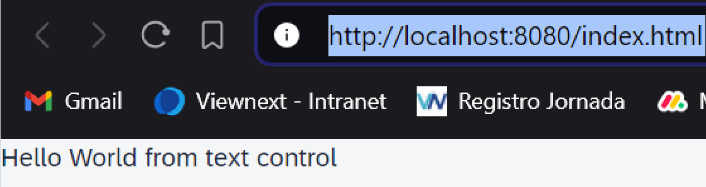

*****************
# Step 3: Controls
*****************

Es el momento de crear nuestra primera interfaz de usuario reemplazando el texto "Hola mundo" por un control SAPUI5: **sap/m/Text**



El texto "Hello world" ahora se muestra mediante un control SAPUI5.

1. Se modifica el fichero [index.html](webapp/index.html)
``` html
<!DOCTYPE html>
<html>

<head>
	<meta charset="utf-8">
	<title>UI5 Walkthrough</title>
	<script 
		id="sap-ui-bootstrap" 
		src="resources/sap-ui-core.js" 
		data-sap-ui-theme="sap_horizon"
		data-sap-ui-libs="sap.m" 
		data-sap-ui-compat-version="edge" 
		data-sap-ui-async="true"
		data-sap-ui-on-init="module:ui5/walkthrough/index" 
		data-sap-ui-resource-roots='{ "ui5.walkthrough": "./"}'>
	</script>
</head>

<body class="sapUiBody" id="content"> </body>

</html>
```
<mark>body class="sapUiBody" id="content"</mark> se define un id para identificar el objeto DOM donde se añadirá el texto.

La clase **sapUiBody** añade estilos adicionales dependientes del tema 
para mostrar aplicaciones SAPUI5.


2. Se modifica el fichero [index.js](webapp/index.js)

``` js
sap.ui.define(["sap/m/Text"], 
    (Text) => {
    "use strict";

new Text({ text: "Hello World from text control"}).placeAt("content"); 
});
```

En lugar de usar JavaScript nativo para mostrar un cuadro de diálogo, queremos usar un control SAPUI5 simple.


Los controles se utilizan para definir la apariencia y el comportamiento de partes de la pantalla.
    
En el ejemplo anterior, la devolución de llamada del evento init es donde ahora creamos 
una instancia de un control de texto SAPUI5. 


El nombre del control tiene como prefijo el espacio de nombres de su biblioteca de control sap/m/ y las opciones se pasan al constructor con un objeto JavaScript. Para nuestro control establecemos la propiedad de texto en el valor "Hola mundo".


Encadenamos la llamada al constructor del control al método estándar placeAt que se utiliza para colocar controles SAPUI5 dentro de un nodo del modelo de objetos de documento (DOM) o cualquier otra instancia de control SAPUI5. Pasamos el ID de un nodo DOM como argumento. 


Como nodo de destino utilizamos la etiqueta del cuerpo del documento HTML y le damos el contenido de ID.