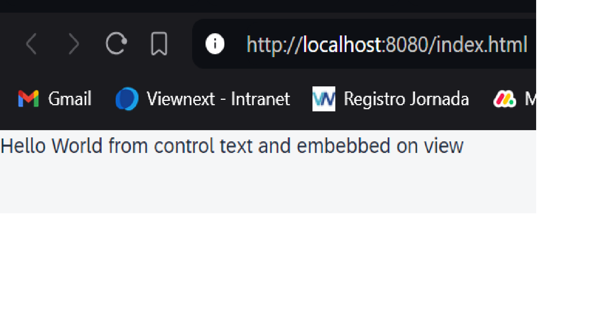

******************
# Step 4: XML Views
******************

Poner toda nuestra interfaz de usuario en el archivo **index.js** muy pronto resultará en una configuración complicada y tenemos bastante trabajo por delante.


Así que hagamos una primera modularización poniendo el control **sap/m/Text en una vista dedicada**.


SAPUI5 admite múltiples tipos de vistas (XML, HTML, JavaScript).


Cuando trabajamos con UI5, recomendamos el uso de XML, ya que esto produce el código más legible y nos obligará a separar la declaración de vista de la lógica del controlador. 
Sin embargo, el aspecto de nuestra interfaz de usuario no cambiará.





El texto "Hello world" ahora se mostrara mediante un control SAPUI5 (sin cambios visuales en el último paso).

1. Se crea nueva carpeta 📂 y fichero [webapp/view/App.view.xml](webapp/view/App.view.xml)

```xml
<mvc:View
   xmlns="sap.m"
   xmlns:mvc="sap.ui.core.mvc">
   <Text text="Hello World from control text and embebbed on view" />
</mvc:View>
```

Dentro de la etiqueta **View**, añadimos un **control de texto** con el valor hardcodeado.

Creamos una nueva carpeta de vista en nuestra carpeta de aplicación web 
y un nuevo archivo llamado **App.view.xml** dentro de esta carpeta. 


El nodo raíz de la estructura XML es la vista. 
Aquí, hacemos referencia al espacio de nombres predeterminado sap.m donde se encuentran la mayoría de nuestros recursos de interfaz de usuario.


Definimos un espacio de nombres adicional sap.ui.core.mvc con alias mvc, donde se ubican las vistas SAPUI5 y todos los demás activos **Model-View-Controller (MVC).


El espacio de nombres identifica todos los recursos del proyecto y debe ser único.


Si desarrolla su propio código o controles de aplicación, no puede utilizar el prefijo de espacio de nombres sap, porque este espacio de nombres está reservado para recursos de SAP.


En su lugar, simplemente defina su propio espacio de nombres único (por ejemplo, myCompany.myApp).


2. Se modifica [/webapp/index.js](./webapp/index.js)

``` js
sap.ui.define([
    "sap/ui/core/mvc/XMLView"
], (XMLView) => {
    "use strict";

XMLView.create({
 viewName: "ui5.walkthrough.view.App"
    }).then((oView) => oView.placeAt("content"));
});
```


Reemplazamos la creación de instancias del control **sap/m/Text** por nuestro nuevo archivo **App.view.xml.**


La vista es creada por una función de SAPUI5.


El nombre tiene el prefijo del espacio de nombres **ui5.walkthrough.view** para identificar de forma única este recurso.


## Convenciones:


- Los nombres de las vistas comienzan con mayúscula.

- Todas las vistas se almacenan en la carpeta de vistas.

- Los nombres de las vistas XML siempre terminan en ***.view.xml**

- El espacio de nombres XML predeterminado es **sap.m**

- Otros espacios de nombres XML utilizan la última parte del espacio de nombres SAP como alias (por ejemplo, mvc para sap.ui.core.mvc)