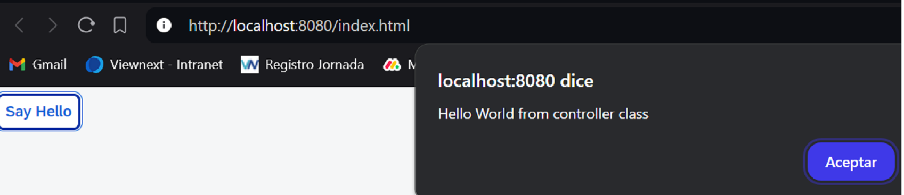

********************
# Step 5: Controllers
********************

En este paso, reemplazamos el texto con un botón y cuando se presione el botón mostraremos el mensaje "Hello world".





1. Se modifica la vista [webapp/view/App.view.xml](webapp/view/App.view.xml)

``` xml
<mvc:View
   controllerName="ui5.walkthrough.controller.App"
   xmlns="sap.m"
   xmlns:mvc="sap.ui.core.mvc">

   <Button
      text="Say Hello"
      press=".onShowHello"/>

</mvc:View>
```


<mark>controllerName="ui5.walkthrough.controller.App"</mark>


Tenemos que especificar el nombre del controlador que está conectado a la vista  configurando el atributo **controllerName** de la vista.


Añadimos un botón con texto **"say Hello"**


Cuando se presiona el botón se lanza el evento **.onShowHello**


El nombre del controlador es una combinación del espacio de nombres de su aplicación seguido del nombre real del controlador.


Una vista no necesariamente necesita de un controlador asignado a ella. 
Si la vista solo muestra información y no se requiere ninguna funcionalidad adicional, 
entonces no es necesario crear un controlador. 
Si se especifica un controlador, se crea una instancia de él después de cargar la vista.


El manejo del evento clik del botón se implementa en el controlador de la vista.


2. Se crea carpeta 📂 y fichero [webapp/controller/App.controller.js](webapp/controller/App.controller.js)

```js
sap.ui.define([
    "sap/ui/core/mvc/Controller"], 
    (Controller) => {
    "use strict";

    return Controller.extend("ui5.walkthrough.controller.App", {
       
       onShowHello() {
          
          alert("Hello World from controller class");
       }

    });
 });
```


Definimos el controlador extendiendo la clase estándar 
**sap/ui/core/mvc/Controller** proporcionado por UI5.


Al principio, contiene solo una función llamada **onShowHello** que maneja el evento de pulsación del botón mostrando una alerta.


## Convenciones


- Los nombres de los controladores deben ser capitalizados.


- Los controladores llevan el mismo nombre que la vista relacionada (si hay una relación 1:1).


- Los controladores de eventos tienen el prefijo **on**


- Los nombres de los controladores siempre terminan en ***.controller.js**