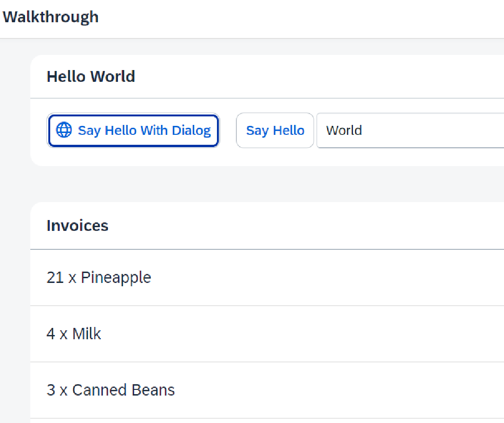

*****************************
# Step 19: Aggregation Binding
*****************************

Ahora que tenemos una buena estructura para nuestra aplicación, es hora de agregar más funciones.



Comenzamos a explorar más funciones del enlace de datos agregando algunos datos de factura en formato **JSON** que mostramos en una lista debajo del panel.


1. Se crea el fichero [webapp/Invoices.json](webapp/Invoices.json)

``` json
{

"Invoices": [

{
"ProductName": "Pineapple",
"Quantity": 21,
"ExtendedPrice": 87.2,
"ShipperName": "Fun Inc.",
"ShippedDate": "2015-04-01T00:00:00",
"Status": "A"
},
{
"ProductName": "Milk",
"Quantity": 4,
"ExtendedPrice": 10,
"ShipperName": "ACME",
"ShippedDate": "2015-02-18T00:00:00",
"Status": "B"
}]
}
```


El archivo **Invoices.json** simplemente contiene cinco facturas en formato JSON que podemos usar para vincular controles contra ellas en la aplicación.


**JSON** es un formato muy liviano para almacenar datos y puede usarse directamente como fuente de datos para aplicaciones SAPUI5.


2. Se modifica el fichero [webapp/manifest.json](webapp/manifest.json)

```json
{
  ...
  "sap.ui5": {
    ...
    "models": {
      "i18n": {
        "type": "sap.ui.model.resource.ResourceModel",
        "settings": {
          "bundleName": "ui5.walkthrough.i18n.i18n",
          "supportedLocales": [
            ""
          ],
          "fallbackLocale": ""
        }
      },
      "invoice": {
        "type": "sap.ui.model.json.JSONModel",
        "uri": "Invoices.json"
      }
    }
  }
  ...
}
```
<mark>invoice</mark>

Sobre la sección **sap.ui5** del descriptor 
añadimos un nuevo modelo de datos de nombre **invoice**.


Esta vez queremos un **JSONModel**, por lo que configuramos el **type** cómo **sap.ui.model.json.JSONModel** 


La clave **uri** es la ruta a nuestro fichero de datos. 


Con esta pequeña configuración, nuestro componente creará automáticamente una instancia de un nuevo **JSONModel** que carga los datos de la factura desde el archivo **Invoices.json**


Finalmente, el **JSONModel** instanciado se coloca en el componente como una factura modelo con nombre. El modelo nombrado luego es visible en toda nuestra aplicación.


3. Se modifica el fichero [webapp/view/App.view.xml](webapp/view/App.view.xml)

```xml
<mvc:View
	controllerName="ui5.walkthrough.controller.App"
	xmlns="sap.m"
	xmlns:mvc="sap.ui.core.mvc"
	displayBlock="true">
    <Shell>
        <App class="myAppDemoWT">
            <pages>
                <Page title="{i18n>homePageTitle}">
                    <content>
                        <Panel
                            headerText="{i18n>helloPanelTitle}"
                            class="sapUiResponsiveMargin"
                            width="auto">
                            <content>
                                <mvc:XMLView
                                    viewName="ui5.walkthrough.view.HelloPanel"/>
                                <mvc:XMLView
                                    viewName="ui5.walkthrough.view.InvoiceList"/>
                            </content>
                        </Panel>
                    </content>
                </Page>
            </pages>
        </App>
    </Shell>
</mvc:View>
```

<mark>viewName="ui5.walkthrough.view.InvoiceList"</mark>


En la vista de la aplicación agregamos una segunda vista para mostrar nuestras facturas debajo del panel.


4. Se crea el fichero [webapp/view/InvoiceList.view.xml](webapp/view/InvoiceList.view.xml)

```xml
<mvc:View
   xmlns="sap.m"
   xmlns:mvc="sap.ui.core.mvc">
   <List
      headerText="{i18n>invoiceListTitle}"
      class="sapUiResponsiveMargin"
      width="auto"
      items="{invoice>/Invoices}" >
      <items>
         <ObjectListItem
            title="{invoice>Quantity} x {invoice>ProductName}"/>
      </items>
   </List>
</mvc:View>
```


La nueva vista muestra un control tipo **List** con un texto de encabezado. Los elementos de la lista de vinculan por la ruta **Invoices** del fichero con datos **JSON**. 


Y dado que definimos un modelo con nombre, tenemos que anteponer a cada definición el identificador **invoice**.


Para los artículos definimos la plantilla para el listado que se repetirá automáticamente para cada factura de nuestros datos de prueba. 


Más precisamente, utilizamos **sap/m/ObjectListItem** para crear un control para cada elemento secundario agregado de la agregación de elementos. 


El atributo **title** de cada elemento de la lista es el identificador único de cada factura.


Esto se logra definiendo una ruta relativa (sin/al principio). Esto funciona porque hemos vinculado la agregación de artículos mediante **items={invoice>/Invoices}** a las facturas.

5. Se modifica el fichero [webapp/i18n/i18n.properties](webapp/i18n/i18n.properties)


``` js
# App Descriptor
appTitle=Hello World
appDescription=A simple walkthrough app that explains the most important concepts of SAPUI5

# Hello Panel
showHelloButtonText=Say Hello
helloMsg=Hello {0}
homePageTitle=Walkthrough
helloPanelTitle=Hello World
openDialogButtonText=Say Hello With Dialog
dialogCloseButtonText=Ok

# Invoice List
invoiceListTitle=Invoices
```

<mark>invoiceListTitle=Invoices</mark>