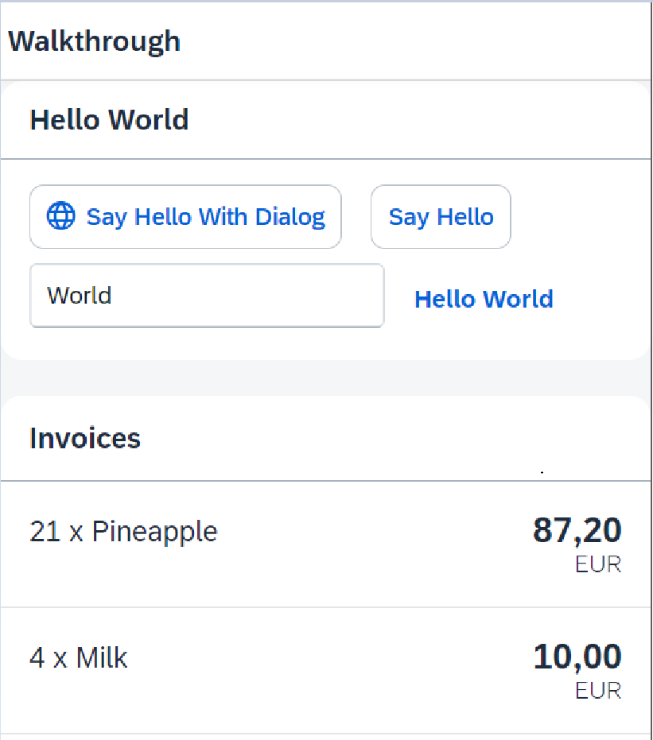

*****************************
# Step 20: Data Types
*****************************

La lista de facturas ya pinta bien, pero ¿qué es una factura sin precio asignado? 
Normalmente los precios se almacenan en un formato técnico y con un '.' delimitador 
en el modelo de datos.


Por ejemplo, nuestra factura de piñas tiene el precio calculado 87,2 sin moneda. 
Usaremos los tipos de datos SAPUI5 para formatear el precio correctamente,
con un separador decimal que depende de la configuración regional y dos dígitos después del separador.


Se mostrará la lista de facturas con precios y unidades numéricas.



1. Se modifica el fichero [webapp/view/InvoiceList.view.xml](webapp/view/InvoiceList.view.xml)


``` XML
<mvc:View
controllerName="ui5.walkthrough.controller.InvoiceList"
   xmlns="sap.m"
   xmlns:mvc="sap.ui.core.mvc">
   <List
      headerText="{i18n>invoiceListTitle}"
      class="sapUiResponsiveMargin"
      width="auto"
      items="{invoice>/Invoices}" >
      <items>
         <ObjectListItem

            title="{invoice>Quantity} x {invoice>ProductName}"

            number="{
                    parts: [ 'invoice>ExtendedPrice',
                             'view>/currency'],
                    type: 'sap.ui.model.type.Currency',
                    formatOptions: { showMeasure: false } }"

           numberUnit="{view>/currency}"/>

      </items>
   </List>
</mvc:View>
```

Se asigna controlador de la vista:

Agregamos un precio a nuestra lista de facturas en la vista agregando los atributos **number** y **numberUnit** al control **ObjectListItem**, 
luego aplicamos el tipo de datos de moneda en el número configurando  el atributo de tipo de la sintaxis de enlace en **sap.ui.model.type.Currency**


Como puede ver arriba, estamos utilizando una sintaxis de enlace especial para la propiedad numérica de **ObjectListItem**. Esta sintaxis de vinculación utiliza los llamados "campos calculados",que permiten vincular múltiples propiedades de diferentes modelos a una única propiedad de un control.


Las propiedades vinculadas a diferentes modelos se denominan "partes".


En el ejemplo anterior, la propiedad del control es número y las propiedades vinculadas (“partes”) recuperadas de dos modelos diferentes son **invoice>ExtendedPrice** and **view>/currency**


Queremos mostrar el precio en euros y, normalmente, la moneda forma parte de nuestro modelo de datos en el back-end. En nuestro caso esto no es así, por lo que debemos definir clave moneda directamente en la aplicación.


Por lo tanto, agregamos un controlador para la lista de facturas y utilizamos la propiedad de moneda como segunda parte de nuestra sintaxis vinculante.


El tipo de moneda manejará el formato del precio por nosotros, según el código de moneda. 
En nuestro caso, el precio se muestra con 2 decimales.


Además, configuramos la opción de formato **showMeasure** en falso. 
Esto oculta el código de moneda en el número de propiedad, porque se pasa al control **ObjectListItem** como una propiedad separada **numberUnit**. 


2. Se crea el fichero [webapp/controller/InvoiceList.controller.js](webapp/controller/InvoiceList.controller.js)

``` js
sap.ui.define([
    "sap/ui/core/mvc/Controller",
    "sap/ui/model/json/JSONModel"], 
    (Controller, JSONModel) => {
    "use strict";

    return Controller.extend("ui5.walkthrough.controller.InvoiceList", {

        onInit() {

            // Se instancia modelo en formato json con el tipo de moneda
            const oViewModel = new JSONModel({
                currency: "EUR"
            });

            // Se asigna modelo a la vista
            this.getView().setModel(oViewModel, "view");
        }
    });
});
```

Para poder acceder al código de moneda que no forma parte de nuestro modelo de datos, 
definimos un modelo y lo asignamos al controlador de la lista de facturas. 


Es un modelo JSON simple con una sola moneda clave y el valor EUR. 
Esto se puede vincular al formateador del campo numérico.


Los modelos de vista pueden contener cualquier opción de configuración asignada a un control
para vincular propiedades como la visibilidad.

## Convenciones
-------------

- Utilizar tipos de datos en lugar de formateadores personalizados siempre que sea posible.
