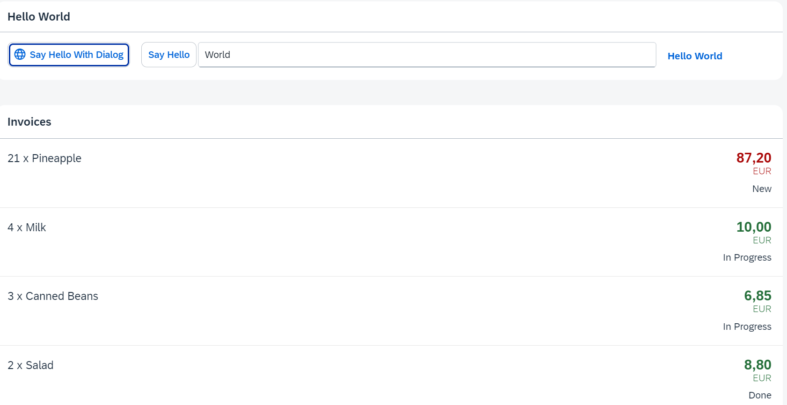

*****************************
# Step 22: Custom Formatters
*****************************

Si queremos hacer una lógica más compleja para formatear las propiedades de nuestro modelo de datos,
también podemos escribir una función de formato personalizada. 
Ahora agregaremos un estado localizado con un formateador personalizado, 
porque el estado en nuestro modelo de datos tiene un formato bastante técnico.

Ahora se muestra un estado con un formateador personalizado


1. Se crea carpeta y función javascript [webapp/model/formatter.js](webapp/model/formatter.js)

``` js
sap.ui.define([], () => {
        "use strict";

return {
statusText(sStatus) {
const oResourceBundle = this.getOwnerComponent().getModel("i18n").getResourceBundle();
switch (sStatus) {

case "A":
return oResourceBundle.getText("invoiceStatusA");

case "B":
return oResourceBundle.getText("invoiceStatusB");

case "C":
return oResourceBundle.getText("invoiceStatusC");


default:
return sStatus;
                        }
                }
        };
});
```


Creamos un carpeta de nombre modelo en nuestro proyecto.
El nuevo archivo formateador se añade sobre la carpeta modelo, porque los formateadores trabajan con las propiedades de los datos y les dan formato para mostrarlos en la interfaz de usuario.

Hasta ahora no teníamos ningún artefacto relacionado con el modelo, excepto el archivo [Invoices.json](webapp/Invoices.json). 
Esta vez no nos extendemos desde ningún objeto base, sino que simplemente devolvemos un objeto JavaScript con nuestras funciones de formateo dentro de sap.ui.define


La función [statusText](webapp/model/formatter.js) obtiene el estado técnico del modelo de datos como parámetro de entrada y devuelve el texto correcto legible por humanos del archivo [i18n](webapp/i18n/i18n.properties).


Accedemos al modelo de datos a través del componente usando 
**this.getOwnerComponent().getModel()** en vez de **this.getView().getModel()**.

La última llamada podría devolver un valor indefinido, porque es posible que la vista aún no se haya adjuntado al componente y, por lo tanto, la vista no puede heredar un modelo del componente.


2. Se modifica el fichero [webapp/controller/InvoiceList.controller.js](webapp/controller/InvoiceList.controller.js)

Para trabajar con nuestra función de formateador, debemos agregarla como módulo en este controlador.
``` js
sap.ui.define([
    "sap/ui/core/mvc/Controller",
    "sap/ui/model/json/JSONModel",
    "../model/formatter"
], (Controller, JSONModel, formatter) => {
    "use strict";

    return Controller.extend("ui5.walkthrough.controller.InvoiceList", {

        formatter: formatter,

        onInit() {

            // Se instancia modelo local con el tipo de moneda en formato json
            const oViewModel = new JSONModel({ currency: "EUR" });

            // Se asigna modelo a la vista
            this.getView().setModel(oViewModel, "view");
        }
    });
});
```


3. Se modifica el fichero [webapp/view/InvoiceList.view.xml](webapp/view/InvoiceList.view.xml)