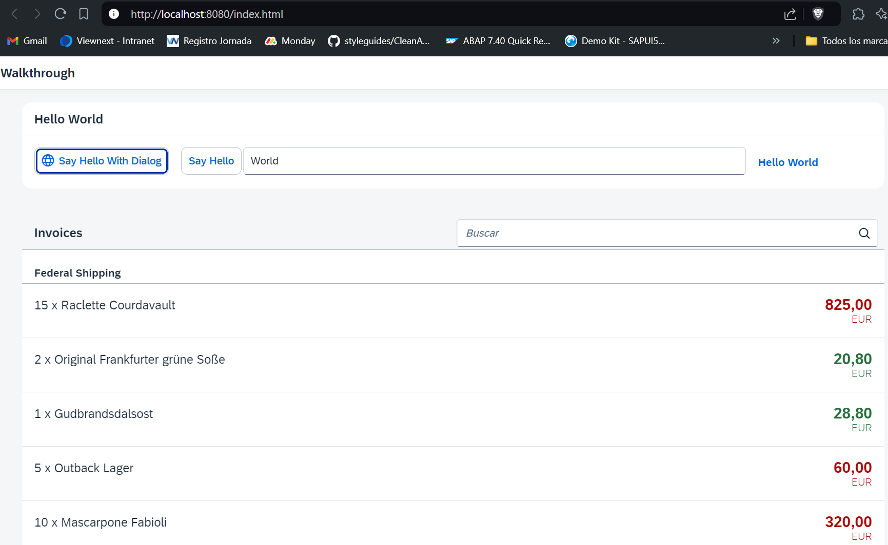
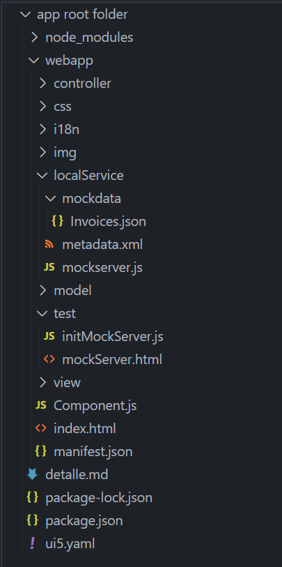

*****************************
# Step 26: Mock Server Configuration
*****************************

Simplemente ejecutamos nuestra aplicación con un servicio real, pero para desarrollar y probar nuestra aplicación no queremos depender de la disponibilidad del servicio "real" ni poner una carga adicional en el sistema donde se encuentra el servicio de datos.
**********

Este sistema es el llamado sistema back-end que ahora simularemos con una función SAPUI5 llamada servidor simulado. Sirve archivos locales, pero simula un sistema back-end de manera más realista que simplemente cargar los datos locales. También cambiaremos la parte de creación de instancias del modelo para que el modelo se configure en el descriptor y SAPUI5 cree una instancia automáticamente. De esta manera, no necesitamos ocuparnos de la creación de instancias del modelo en el código.


## Previsualización


La lista de facturas ahora la proporciona el servidor simulado.

Estructura de carpetas para este paso





La estructura de carpetas de nuestro proyecto de aplicación separa claramente los archivos de prueba y productivos después de este paso. La nueva carpeta de prueba ahora contiene una nueva página HTML mockServer.html que iniciará nuestra aplicación en modo de prueba sin llamar al servicio real.

La nueva carpeta localService contiene un archivo de descripción de servicio metadata.xml para OData, el archivo mockserver.js que simula un servicio real con datos locales y la subcarpeta simulada que contiene los datos de prueba locales (Invoices.json).

1. Se crea carpeta y fichero [webapp/test/mockServer.html](webapp/test/mockServer.html)


``` html
<!DOCTYPE html>
<html>
<head>
	<meta charset="utf-8">
	<title>SAPUI5 UI5 Walkthrough - Mockserver Test Page</title>
	<script
		id="sap-ui-bootstrap"
		src="../resources/sap-ui-core.js"
		data-sap-ui-theme="sap_horizon"
		data-sap-ui-compat-version="edge"
		data-sap-ui-async="true"
		data-sap-ui-on-init="module:ui5/walkthrough/test/initMockServer"
		data-sap-ui-resource-roots='{
			"ui5.walkthrough": "../"
		}'>
	</script>
</head>
<body class="sapUiBody" id="content">
	<div data-sap-ui-component data-name="ui5.walkthrough" data-id="container" data-settings='{"id" : "walkthrough"}'></div>

</body>
</html>
```


Copiamos index.html a un archivo separado en la carpeta webapp/test y lo llamamos mockServer.html. Ahora usaremos este archivo para ejecutar nuestra aplicación en modo de prueba con datos simulados cargados desde un archivo JSON. Las páginas de prueba no deben colocarse en la carpeta raíz de la aplicación, sino en una subcarpeta llamada prueba para separar claramente la codificación productiva y de prueba.

A partir de este momento, tendrá dos páginas de entrada diferentes: una para la aplicación real "conectada" (index.html) y otra para pruebas locales (mockServer.html). Puede decidir libremente si desea realizar los siguientes pasos con los datos reales del servicio o con los datos locales dentro de la aplicación.

Modificamos el archivo mockServer.html y cambiamos el título de la página para distinguirla de la página de inicio productiva. En el arranque, la propiedad data-sap-ui-resource-roots también se cambia. El espacio de nombres ahora apunta a la carpeta de arriba ("../"), porque el archivo mockServer.html ahora está en una subcarpeta de la carpeta de la aplicación web. En lugar de cargar el componente de la aplicación directamente, ahora llamamos a un script initMockServer.js.


2. Se crea fichero [webapp/test/initMockServer.js](webapp/test/initMockServer.js)


``` js
sap.ui.define([
	"../localService/mockserver"
], (mockserver) => {
	"use strict";

	// initialize the mock server
	mockserver.init();

	// initialize the embedded component on the HTML page
	sap.ui.require(["sap/ui/core/ComponentSupport"]);
});
```


La primera dependencia es un archivo llamado mockserver.js que se ubicará más adelante en la carpeta localService.


La dependencia del servidor simulado que estamos a punto de implementar es nuestro servidor de prueba local. Su método init se llama inmediatamente antes de cargar el componente. De esta manera, podemos capturar todas las solicitudes que irían al servicio "real" y procesarlas localmente en nuestro servidor de prueba al iniciar la aplicación con el archivo mockServer.html. El componente en sí no "sabe" que ahora se ejecutará en modo de prueba.


3. Se crea carpeta y fichero [webapp/localService/mockdata/Invoices.json](webapp/localService/mockdata/Invoices.json)

``` json
[
    {
      "ProductName": "Pineapple",
      "Quantity": 21,
      "ExtendedPrice": 87.2,
      "ShipperName": "Fun Inc.",
      "ShippedDate": "2015-04-01T00:00:00",
      "Status": "A"
    },
    {
      "ProductName": "Milk",
      "Quantity": 4,
      "ExtendedPrice": 10,
      "ShipperName": "ACME",
      "ShippedDate": "2015-02-18T00:00:00",
      "Status": "B"
    },
    {
      "ProductName": "Canned Beans",
      "Quantity": 3,
      "ExtendedPrice": 6.85,
      "ShipperName": "ACME",
      "ShippedDate": "2015-03-02T00:00:00",
      "Status": "B"
    },
    {
      "ProductName": "Salad",
      "Quantity": 2,
      "ExtendedPrice": 8.8,
      "ShipperName": "ACME",
      "ShippedDate": "2015-04-12T00:00:00",
      "Status": "C"
    },
    {
      "ProductName": "Bread",
      "Quantity": 1,
      "ExtendedPrice": 2.71,
      "ShipperName": "Fun Inc.",
      "ShippedDate": "2015-01-27T00:00:00",
      "Status": "A"
    }
  ]
```


El archivo Invoices.json es similar a nuestro archivo anterior en la carpeta webapp. Simplemente copie el contenido y elimine la estructura del objeto externo con las facturas clave para que el archivo consista en una matriz plana de elementos de factura. Nuestro servidor leerá automáticamente este archivo más adelante en este paso.


Elimine el antiguo archivo Invoices.json de la carpeta de la aplicación web; ya no se utiliza.


4. Se crea fichero [webapp/localService/metadata.xml](webapp/localService/metadata.xml)


``` xml
<edmx:Edmx Version="1.0" xmlns:edmx="http://schemas.microsoft.com/ado/2007/06/edmx">
	<edmx:DataServices m:DataServiceVersion="1.0" m:MaxDataServiceVersion="3.0"
			xmlns:m="http://schemas.microsoft.com/ado/2007/08/dataservices/metadata">
		<Schema Namespace="NorthwindModel" xmlns="http://schemas.microsoft.com/ado/2008/09/edm">
			<EntityType Name="Invoice">
				<Key>
					<PropertyRef Name="ProductName"/>
					<PropertyRef Name="Quantity"/>
					<PropertyRef Name="ShipperName"/>
				</Key>
				<Property Name="ShipperName" Type="Edm.String" Nullable="false" MaxLength="40" FixedLength="false"
							Unicode="true"/>
				<Property Name="ProductName" Type="Edm.String" Nullable="false" MaxLength="40" FixedLength="false"
							Unicode="true"/>
				<Property Name="Quantity" Type="Edm.Int16" Nullable="false"/>
				<Property Name="ExtendedPrice" Type="Edm.Decimal" Precision="19" Scale="4"/>
				<Property Name="Status" Type="Edm.String" Nullable="false" MaxLength="1" FixedLength="false"
							Unicode="true"/>
			</EntityType>
		</Schema>
		<Schema Namespace="ODataWebV2.Northwind.Model" xmlns="http://schemas.microsoft.com/ado/2008/09/edm">
			<EntityContainer Name="NorthwindEntities" m:IsDefaultEntityContainer="true" p6:LazyLoadingEnabled="true"
					xmlns:p6="http://schemas.microsoft.com/ado/2009/02/edm/annotation">
				<EntitySet Name="Invoices" EntityType="NorthwindModel.Invoice"/>
			</EntityContainer>
		</Schema>
	</edmx:DataServices>
</edmx:Edmx>

```


El archivo de metadatos contiene información sobre la interfaz del servicio y no es necesario escribirlo manualmente. Se puede acceder directamente desde el servicio "real" llamando a la URL del servicio y agregando $metadata al final (por ejemplo, en nuestro caso http://services.odata.org/V2/Northwind/Northwind.svc/$metadata). El servidor simulado leerá este archivo para simular el servicio OData real y devolverá los resultados de nuestros archivos fuente locales en el formato adecuado para que la aplicación pueda consumirlos (ya sea en formato XML o JSON).


Para simplificar, hemos eliminado todo el contenido del documento de metadatos original de Northwind OData que no necesitamos en nuestro escenario. También agregamos el campo de estado a los metadatos ya que no está disponible en el servicio real de Northwind.


5. Se crea fichero [webapp/localService/mockserver.js](webapp/localService/mockserver.js)


``` js
sap.ui.define([
	"sap/ui/core/util/MockServer"
], (MockServer) => {
	"use strict";

	return {
		init() {
			// create
			const oMockServer = new MockServer({
				rootUri: sap.ui.require.toUrl("ui5/walkthrough") + "/V2/Northwind/Northwind.svc/"
			});

			const oUrlParams = new URLSearchParams(window.location.search);

			// configure mock server with a delay
			MockServer.config({
				autoRespond: true,
				autoRespondAfter: oUrlParams.get("serverDelay") || 500
			});

			// simulate
			const sPath = sap.ui.require.toUrl("ui5/walkthrough/localService");
			oMockServer.simulate(sPath + "/metadata.xml", sPath + "/mockdata");

			// start
			oMockServer.start();
		}
	};
});
```


Ahora que hemos agregado el archivo de descripción del servicio OData metadata.xml, podemos escribir el código para inicializar el servidor simulado que luego simulará cualquier solicitud de OData al servidor Northwind real.


Cargamos el módulo estándar SAPUI5 MockServer como una dependencia y creamos un objeto auxiliar que define un método init para iniciar el servidor. Este método se llama antes de la inicialización del componente en el archivo mockServer.html anterior. El método init crea una instancia de MockServer con la misma URL que las llamadas al servicio real.


La URL en el parámetro de configuración rootUri debe apuntar a la misma URL definida en la propiedad uri de la fuente de datos en el archivo descriptor manifest.json. En manifest.json, UI5 interpreta automáticamente una URL relativa como relativa al espacio de nombres de la aplicación. En el código JavaScript, puede garantizar esto utilizando el método sap.ui.require.toUrl. Luego, sap/ui/core/util/MockServer detecta cada solicitud al servicio real y devuelve una respuesta. A continuación, establecemos dos ajustes de configuración global que le indican al servidor que responda automáticamente e introducen un retraso de 500 ms para simular un tiempo de respuesta típico del servidor. De lo contrario, tendríamos que llamar manualmente al método de respuesta en MockServer para simular la llamada.


Para simular un servicio, simplemente podemos llamar al método de simulación en la instancia de MockServer con la ruta a nuestro metadata.xml recién creado. Esto leerá los datos de prueba de nuestro sistema de archivos local y configurará los patrones de URL que imitarán el servicio real.


Finalmente, llamamos a iniciar en oMockServer. A partir de este punto, MockServer procesará cada solicitud al patrón de URL rootUri. Si cambia del archivo index.html al archivo mockServer.html en el navegador, ahora podrá ver que los datos de prueba se muestran nuevamente desde las fuentes locales, pero con un breve retraso. El retraso se puede especificar con el parámetro URI serverDelay.


Este enfoque es perfecto para pruebas locales, incluso sin conexión de red. De esta manera su desarrollo no depende de la disponibilidad de un servidor remoto, es decir. para ejecutar sus pruebas.


Intente llamar a la aplicación con el archivo index.html y el archivo mockServer.html para ver la diferencia. Si no se puede establecer la conexión de servicio real, por ejemplo cuando no hay conexión de red, siempre puede recurrir a la página de prueba local.


6. Se modifica fichero [package.json](package.json)


Para facilitar el desarrollo local, ajustamos el script de inicio en package.json para abrir mockServer.html en lugar de index.html:


``` json
{
  "name": "ui5.walkthrough",
  "version": "1.0.0",
  "description": "The UI5 walkthrough application",
  "scripts": {
      "start": "ui5 serve -o test/mockServer.html"
  },
  "devDependencies": {
    "@ui5/cli": "^3",
    "ui5-middleware-simpleproxy": "^3"
  }
}
```


## Convenciones


- La carpeta webapp/test contiene únicamente código no productivo.

- Los datos simulados y el script para iniciar MockServer se almacenan en la carpeta webapp/localService.

- El script para iniciar MockServer se llama mockserver.js.
