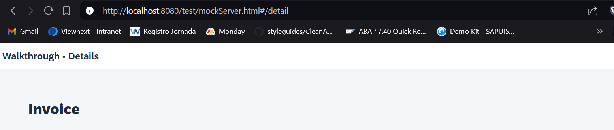

*****************************
# Step 30: Routing and Navigation
*****************************

Hasta ahora, hemos colocado todo el contenido de la aplicación en una sola página. A medida que agreguemos más funciones, queremos dividir el contenido y colocarlo en páginas separadas.
*****************************

En este paso, utilizaremos las funciones de navegación de SAPUI5 para cargar y mostrar una página de detalles independiente que luego podemos utilizar para mostrar los detalles de una factura. En los pasos anteriores, definimos la página directamente en la vista de la aplicación para que se muestre cuando se cargue la aplicación. Ahora utilizaremos la clase de enrutador SAPUI5 para cargar las páginas y actualizar la URL automáticamente. Especificamos una configuración de enrutamiento para nuestra aplicación y creamos una vista independiente para cada página de la aplicación; luego, conectamos las vistas activando eventos de navegación.


## Previsualización


Se agrega una segunda página para mostrar la factura.

1. Se modifica fichero [webapp/manifest.json](webapp/manifest.json)

``` json
{
  ...
  "sap.ui5": {
  ...
    "routing": {
      "config": {
        "routerClass": "sap.m.routing.Router",
        "type": "View",
        "viewType": "XML",
        "path": "ui5.walkthrough.view",
        "controlId": "app",
        "controlAggregation": "pages"
      },
      "routes": [
        {
          "pattern": "",
          "name": "overview",
          "target": "overview"
        },
        {
          "pattern": "detail",
          "name": "detail",
          "target": "detail"
        }
      ],
      "targets": {
        "overview": {
          "id": "overview",
          "name": "Overview"
        },
        "detail": {
          "id": "detail",
          "name": "Detail"
        }
      }
    }
  }
}
```

Agregamos una nueva sección de “enrutamiento” a la parte sap.ui5 del descriptor. Hay tres subsecciones que definen la estructura de navegación y enrutamiento de la aplicación:


- config

Esta sección contiene la configuración global del enrutador y los valores predeterminados que se aplican a todas las rutas y destinos. Definimos la clase de enrutador que queremos usar y dónde se ubican nuestras vistas en la aplicación. Para cargar y mostrar las vistas automáticamente, también especificamos qué control se usa para mostrar las páginas y qué agregación se debe completar cuando se muestra una nueva página.


- routes

Cada ruta define un nombre, un patrón y uno o más destinos a los que navegar cuando se ha alcanzado la ruta. El patrón es básicamente la parte de la URL que coincide con la ruta. Definimos dos rutas para nuestra aplicación. La primera es una ruta predeterminada que mostrará la página de descripción general con el contenido de los pasos anteriores y la segunda es la ruta de detalles con el patrón de URL detail que mostrará una nueva página.


- targets

Un destino define una vista, o incluso otro componente, que se muestra; está asociado con una o más rutas y también se puede mostrar manualmente desde la aplicación. Siempre que se muestra un destino, se carga la vista correspondiente y se muestra en la aplicación. En nuestra aplicación, simplemente definimos dos destinos con nombres de vista que corresponden al nombre del objetivo.


2. Se modifica fichero [webapp/Component.js](webapp/Component.js)


``` js
sap.ui.define([
	"sap/ui/core/UIComponent",
	"sap/ui/model/json/JSONModel"
], (UIComponent, JSONModel) => {
	"use strict";

	return UIComponent.extend("ui5.walkthrough.Component", {

		metadata: {
			interfaces: ["sap.ui.core.IAsyncContentCreation"],
			manifest: "json"
		},

		init() {
			// call the init function of the parent
			UIComponent.prototype.init.apply(this, arguments);

			// set data model
			const oData = {
				recipient: {
					name: "World"
				}
			};

			const oModel = new JSONModel(oData);
			this.setModel(oModel);

			// Se instancia enrutador de vistas basadas en url/hash
			this.getRouter().initialize();
		}
	});
});
```

En el método de inicialización del componente, ahora agregamos una llamada para inicializar el enrutador. No necesitamos crear una instancia del enrutador manualmente, se crea una instancia automáticamente según nuestra configuración de AppDescriptor y se asigna al componente.

Al inicializar el enrutador, se evaluará la URL actual y se cargará la vista correspondiente automáticamente. Esto se hace con la ayuda de las rutas y los destinos que se han configurado en el manifest.json, también conocido como descriptor de la aplicación. Si se ha alcanzado una ruta, se carga y se muestra la vista de su destino correspondiente.

3. Se crea fichero [webapp/view/Overview.view.xml(New)](webapp/view/Overview.view.xml)

``` xml
<mvc:View
    controllerName="ui5.walkthrough.controller.App"
    xmlns="sap.m"
    xmlns:mvc="sap.ui.core.mvc"
    displayBlock="true">
    <Page title="{i18n>homePageTitle}">
        <content>
            <mvc:XMLView viewName="ui5.walkthrough.view.HelloPanel" />
            <mvc:XMLView viewName="ui5.walkthrough.view.InvoiceList" />
        </content>
    </Page>
</mvc:View>
``` 

Trasladamos el contenido de los pasos anteriores de la vista de la aplicación a una nueva vista de descripción general. Para simplificar, no cambiamos el controlador, ya que solo contiene nuestro método auxiliar para abrir el cuadro de diálogo, lo que significa que reutilizamos el controlador ui5.walkthrough.controller.App para dos vistas diferentes (para la nueva vista general y para la vista de la aplicación). Sin embargo, se crean dos instancias de ese controlador en tiempo de ejecución. En general, se crea una instancia de un controlador para cada vista que hace referencia al controlador.


4. Se modifica el fichero [webapp/view/App.view.xml](webapp/view/App.view.xml)
``` xml
<mvc:View
    controllerName="ui5.walkthrough.controller.App"
    xmlns="sap.m"
    xmlns:mvc="sap.ui.core.mvc"
    displayBlock="true">
    <Shell>
        <App
            class="myAppDemoWT"
            id="app"/>
    </Shell>
</mvc:View>
```
Nuestra vista de aplicación ahora solo contiene la etiqueta de aplicación vacía. El enrutador agregará automáticamente la vista que corresponde a la URL actual en el control de aplicación. El enrutador identifica el control de aplicación con el ID que corresponde a la propiedad controlId: “app” en AppDescriptor.


5. Se crea el fichero [webapp/view/Detail.view.xml (New)](webapp/view/Detail.view.xml)
``` xml
<mvc:View
	xmlns="sap.m"
	xmlns:mvc="sap.ui.core.mvc">
	<Page
		title="{i18n>detailPageTitle}">
		<ObjectHeader title="Invoice"/>
	</Page>
</mvc:View>
```

Ahora agregamos una segunda vista para la vista de detalles. Por ahora, solo contiene una página y un control ObjectHeader que muestra el texto estático Factura.


6. Se modifica el fichero [webapp/i18n/i18n.properties](webapp/i18n/i18n.properties)
``` js
# Invoice List
invoiceListTitle=Invoices
invoiceStatusA=New
invoiceStatusB=In Progress
invoiceStatusC=Done

# Detail Page
detailPageTitle=Walkthrough - Details
```
Agregamos una nueva cadena al paquete de recursos para el título de la página de detalles.

7. Se modifica el fichero [webapp/view/InvoiceList.view.xml](webapp/view/InvoiceList.view.xml)
``` xml
<mvc:View
    controllerName="ui5.walkthrough.controller.InvoiceList"
    xmlns="sap.m"
    xmlns:core="sap.ui.core"
    xmlns:mvc="sap.ui.core.mvc">
    ...
        <items>
            <ObjectListItem
                title="{invoice>Quantity} x {invoice>ProductName}"
                number="{
                    parts: [
                        'invoice>ExtendedPrice',
                        'view>/currency'
                    ],
                    type: 'sap.ui.model.type.Currency',
                    formatOptions: {
                        showMeasure: false
                    }
                }"
                numberUnit="{view>/currency}"
                numberState="{= ${invoice>ExtendedPrice} > 50 ? 'Error' : 'Success' }"
                type="Navigation"
                press=".onPress" >
                <firstStatus>
                    <ObjectStatus
                        core:require="{
                          Formatter: 'ui5/walkthrough/model/formatter'
                        }"
                        text="{
                            path: 'invoice>Status',
                            formatter: 'Formatter.statusText.bind($controller)'
                        }"/>
                </firstStatus>
            </ObjectListItem>
        </items>
    </List>
</mvc:View>
```
En la vista de lista de facturas, agregamos un evento sobre el elemento de la lista y configuramos el tipo de elemento en Navegación para que se pueda hacer clic en el elemento.


8. Se modifica el fichero [webapp/controller/InvoiceList.controller.js](webapp/controller/InvoiceList.controller.js)

``` js
sap.ui.define([
	"sap/ui/core/mvc/Controller",
	"sap/ui/model/json/JSONModel",
	"../model/formatter",
	"sap/ui/model/Filter",
	"sap/ui/model/FilterOperator"
], (Controller, JSONModel, Filter, FilterOperator) => {
	"use strict";

	return Controller.extend("ui5.walkthrough.controller.InvoiceList", {

		…

		onPress() {
			const oRouter = this.getOwnerComponent().getRouter();
			oRouter.navTo("detail");
		}
	});
});
```

Agregamos la función del controlador de eventos al controlador de nuestra lista de facturas. Ahora es momento de navegar a la página de detalles haciendo clic en un elemento de la lista de facturas. Accedemos a la instancia del enrutador para nuestra aplicación llamando al método auxiliar getOwnerComponent().getRouter(). En el enrutador, llamamos al método navTo para navegar a la ruta de detalles que especificamos en la configuración de enrutamiento.

Ahora debería ver la página de detalles cuando haga clic en un elemento de la lista de facturas.


## Convenciones


- Definir la configuración de enrutamiento en el descriptor
- Inicialice el enrutador al final de su función Component#init
