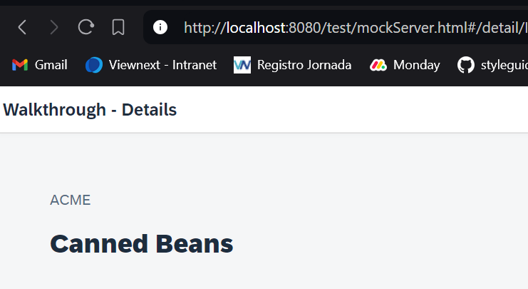

*****************************
# Step 31: Routing with Parameters

*****************************

Ahora podemos navegar entre la descripción general y la página de detalles, pero el elemento real que seleccionamos en la descripción general aún no se muestra en la página de detalles. Un caso de uso típico de nuestra aplicación es mostrar información adicional para el elemento seleccionado en la página de detalles.

*****************************

## Previsualización

Los detalles de la factura seleccionada ahora se muestran en la página de detalles.

## Código

1. Se modifica [webapp/manifest.json](webapp/manifest.json)


``` json
{
  …
  "sap.ui5":{
	…
	"routing": {
	  "config": {
		"routerClass": "sap.m.routing.Router",
		"type": "View",
		"viewType": "XML",
		"path": "ui5.walkthrough.view",
		"controlId": "app",
		"controlAggregation": "pages"
	  },
	  "routes": [
		{
		  "pattern": "",
		  "name": "overview",
		  "target": "overview"
		},
		{
      "pattern": "detail/{invoicePath}",
		  "name": "detail",
		  "target": "detail"
		}
	  ],
		  "targets": {
		"overview": {
		  "id": "overview",
		  "name": "Overview"
		},
		"detail": {
		  "id": "detail",
		  "name": "Detail"
		}
	  }
	}
  }
}
```
> <mark>"pattern": "detail/{invoicePath}"</mark>


Agregamos un parámetro de navegación **invoicePath** a la ruta de detalles para que podamos pasar la información del artículo seleccionado a la página de detalles. Los parámetros de navegación obligatorios se definen entre llaves.


2. Se modifica fichero [webapp/view/Detail.view.xml](webapp/view/Detail.view.xml)


``` xml
<mvc:View
	controllerName="ui5.walkthrough.controller.Detail"
	xmlns="sap.m"
	xmlns:mvc="sap.ui.core.mvc">
	<Page
		title="{i18n>detailPageTitle}">
		<ObjectHeader
			intro="{invoice>ShipperName}"
			title="{invoice>ProductName}"/>
	</Page>
</mvc:View>
```

Agregamos un controlador que se encargará de establecer el contexto del artículo en la vista y vincular algunas propiedades del ObjectHeader a los campos de nuestro modelo de factura. 

Podríamos agregar información más detallada del objeto de factura aquí, pero por razones de simplicidad solo mostramos dos campos por ahora.


3. Se modifica el fichero [webapp/controller/InvoiceList.controller.js](webapp/controller/InvoiceList.controller.js)

``` js
sap.ui.define([
	"sap/ui/core/mvc/Controller",
	"sap/ui/model/json/JSONModel",
	"sap/ui/model/Filter",
	"sap/ui/model/FilterOperator"
], (Controller, JSONModel, Filter, FilterOperator) => {
	"use strict";

	return Controller.extend("ui5.walkthrough.controller.InvoiceList", {
		…

		onPress(oEvent) {
			const oItem = oEvent.getSource();
			const oRouter = this.getOwnerComponent().getRouter();
			oRouter.navTo("detail", {
				invoicePath: window.encodeURIComponent(oItem.getBindingContext("invoice").getPath().substr(1))
			});
		}
	});
});
```

<mark>oEvent</mark>


<mark>oRouter.navTo</mark>


Se puede acceder a la instancia de control con la que se ha interactuado mediante el método **getSource**, que está disponible para todos los eventos de SAPUI5. 


Devolverá el **ObjectListItem** en el que se ha hecho clic en nuestro caso. Lo utilizaremos para pasar la información del elemento en el que se ha hecho clic a la página de detalles para que el mismo elemento se pueda mostrar allí.

En el método **navTo**, ahora agregamos un objeto de configuración para completar el parámetro de navegación **invoicePath** con la información actual del elemento. 


Esto actualizará la URL y navegará a la vista de detalles al mismo tiempo. En la página de detalles, podemos acceder nuevamente a esta información de contexto y mostrar el elemento correspondiente.

Para identificar el objeto que seleccionamos, normalmente utilizaríamos la clave del elemento en el sistema de back-end porque es breve y precisa. Sin embargo, para nuestras facturas, no tenemos una clave simple y utilizamos directamente la ruta de enlace para mantener el ejemplo breve y simple. La ruta al elemento es parte del contexto de enlace, que es un objeto auxiliar de SAPUI5 para administrar la información de enlace para los controles. Se puede acceder al contexto de enlace llamando al método **getBindingContext** con el nombre del modelo en cualquier control SAPUI5 enlazado. 
Necesitamos eliminar la primera / de la ruta de enlace llamando a .substr(1) en la cadena porque este es un carácter especial en las URL y no está permitido; lo agregaremos nuevamente en la página de detalles. Además, la ruta de enlace puede contener caracteres especiales que no están permitidos en las URL, por lo que debemos codificar la ruta con **encodeURIComponent**.


4. Se crea controlador de vista detalle [webapp/controller/Detail.controller.js (New)](webapp/controller/Detail.controller.js)


``` js
sap.ui.define([
	"sap/ui/core/mvc/Controller"
], (Controller) => {
	"use strict";

	return Controller.extend("ui5.walkthrough.controller.Detail", {
		onInit() {
      
			const oRouter = this.getOwnerComponent().getRouter();
			      oRouter.getRoute("detail").attachPatternMatched(this.onObjectMatched, this);
		},

		onObjectMatched(oEvent) {
			this.getView().bindElement({
				path: "/" + window.decodeURIComponent(oEvent.getParameter("arguments").invoicePath),
				model: "invoice"
			});
		}
	});
});
```

Nuestra última pieza del rompecabezas es el **controlador de detalles**. Debe establecer el contexto que pasamos con el parámetro URL **invoicePath** en la vista, de modo que se muestre realmente el elemento que se ha seleccionado en la lista de facturas; de lo contrario, la vista permanecería vacía.

En el método **onInit** del controlador, obtenemos la instancia de nuestro enrutador de aplicaciones y lo adjuntamos a la ruta de detalles llamando al método **attachedPatternMatched** en la ruta a la que accedimos por su nombre. 
Registramos una función de devolución de llamada interna **onObjectMatched** que se ejecutará cuando se acceda a la ruta, ya sea haciendo clic en el elemento o llamando a la aplicación con una URL para la página de detalles.

En el método **onObjectMatched** que activa el enrutador, recibimos un evento que podemos usar para acceder a la URL y los parámetros de navegación. El parámetro arguments devolverá un objeto que corresponde a nuestros parámetros de navegación del patrón de ruta. Accedemos a **invoicePath** que configuramos en el controlador de lista de facturas y llamamos a la **función bindElement** en la vista para configurar el contexto. Tenemos que agregar nuevamente la raíz / delante de la ruta que se eliminó para pasar la ruta como parámetro de URL. Debido a que hemos codificado la parte de la ruta de enlace en la URL anteriormente, tenemos que decodificarla nuevamente con decodeURIComponent.


La función **bindElement** crea un contexto de enlace para un control SAPUI5 y recibe el nombre del modelo, así como la ruta a un elemento en un objeto de configuración. Esto activará una actualización de los controles de la interfaz de usuario que conectamos con los campos del modelo de factura. Ahora debería ver los detalles de la factura en una página separada cuando haga clic en un elemento de la lista de facturas.


## Convenciones


- Definir configuración de enrutamiento en el [manifest.json=>routing=>routes](webapp/manifest.json)

- Inicializar el enrutador al final de la función [webapp/Component.js=>init](webapp/Component.js)