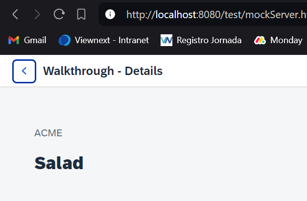

*****************************
# Step 32: Routing Back and History
*****************************

Ahora podemos navegar a nuestra página de detalles y mostrar una factura, pero aún no podemos volver a la página de descripción general. Agregaremos un botón para retroceder desde la página de detalles e implementaremos una función para ello.

*****************************

## Previsualización

Ahora se muestra un botón Atrás en la página de detalles.

## Código

1. Se modifica [webapp/view/Detail.view.xml](webapp/view/Detail.view.xml)


``` xml
<mvc:View
	controllerName="ui5.walkthrough.controller.Detail"
	xmlns="sap.m"
	xmlns:mvc="sap.ui.core.mvc">
	<Page
		title="{i18n>detailPageTitle}"
		showNavButton="true"
		navButtonPress=".onNavBack">
		<ObjectHeader
			intro="{invoice>ShipperName}"
			title="{invoice>ProductName}"/>
	</Page>
</mvc:View>
```
> <mark>showNavButton</mark>


> <mark>navButtonPress</mark>


En la página de detalles, le indicamos al control que muestre un botón Atrás configurando el parámetro **showNavButton** como verdadero y registramos un controlador de eventos que se llama cuando se presiona el botón Atrás.


2. Se modifica controlador detalle [webapp/controller/Detail.controller.js](webapp/controller/Detail.controller.js)


``` js
sap.ui.define([npm i -D @ui5/cli
	"sap/ui/core/mvc/Controller",
	"sap/ui/core/routing/History"], 
	(Controller,History) => {
	"use strict";

	return Controller.extui5 initend("ui5.walkthrough.controller.Detail", {
		
		onInit() {
      
			const oRouter = this.getOwnerComponent().getRouter();
			      oRouter.getRoute("detail").attachPatternMatched(this.onObjectMatched, this);
		},

		onObjectMatched(oEvent) {
			this.getView().bindElement({
				path: "/" + window.decodeURIComponent(oEvent.getParameter("arguments").invoicePath),
				model: "invoice"
			});
		},
		
		onNavBack() {
			const oHistory = History.getInstance();
			const sPreviousHash = oHistory.getPreviousHash();

			if (sPreviousHash !== undefined) {
				window.history.go(-1);
			} else {
				const oRouter = this.getOwnerComponent().getRouter();
				oRouter.navTo("overview", {}, true);
			}
		}
	});
});
```
Cargamos una nueva dependencia llamada **History** que nos ayuda a administrar el historial de navegación desde el espacio de nombres **sap.ui.core.routing** y agregamos la implementación del controlador de eventos a nuestro controlador de página de detalles.


En el controlador de eventos accedemos al historial de navegación e intentamos determinar el hash anterior. A diferencia del historial del navegador, obtendremos un resultado válido solo si ya se realizó un paso de navegación dentro de nuestra aplicación. Entonces simplemente usaremos el historial del navegador para volver a la página anterior. Si no se realizó ninguna navegación antes, podemos indicarle al enrutador que vaya directamente a nuestra página de descripción general. El tercer parámetro true le indica al enrutador que reemplace el estado del historial actual con el nuevo, ya que en realidad realizamos una navegación hacia atrás por nosotros mismos. El segundo parámetro es una matriz vacía ({}) ya que no pasamos ningún parámetro adicional a esta ruta.


Esta implementación es un poco mejor que el botón de retroceso del navegador para nuestro caso de uso. El navegador simplemente retrocedería un paso en el historial aunque estuviéramos en otra página fuera de la aplicación. En la aplicación, siempre queremos volver a la página de descripción general, incluso si venimos de otro enlace o abrimos la página de detalles directamente con un marcador. Puede probarlo cargando la página de detalles en una nueva pestaña directamente y haciendo clic en el botón de retroceso en la aplicación; igualmente volverá a la página de descripción general.

## Convenciones


- Agregue una ruta para regresar a la página principal cuando el estado del historial no esté claro.