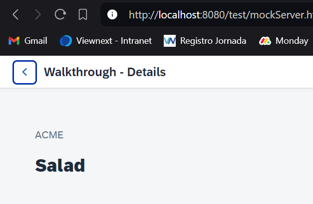

*****************************
# Step 33: Custom Controls
*****************************

En este paso, ampliaremos la funcionalidad de SAPUI5 con un control personalizado. Queremos calificar el producto que se muestra en la página de detalles, por lo que creamos una composición de múltiples controles estándar utilizando el mecanismo de extensión de SAPUI5 y agregamos un código de unión para que funcionen bien juntos. De esta manera, podemos reutilizar el control en toda la aplicación y mantener todas las funciones relacionadas en un solo módulo.

*****************************

## Previsualización

Se agrega un control de calificación de producto personalizado a la página de detalles.

## Código

1. Se crea [webapp/control/ProductRating.js (New)](webapp/control/ProductRating.js)


``` js
sap.ui.define([
	"sap/ui/core/Control"
], (Control) => {
	"use strict";

	return Control.extend("ui5.walkthrough.control.ProductRating", {
		metadata : {},

		init() {},

		renderer(oRM, oControl) {}
	});
});
```


Creamos un nuevo control de carpeta y un archivo ProductRating.js que contendrá nuestro nuevo control. Al igual que con nuestros controladores y vistas, el control personalizado hereda la funcionalidad de control común de un objeto base SAPUI5; para los controles, esto se hace extendiendo la clase base sap.ui.core.Control.


Los controles personalizados son pequeños componentes reutilizables que se pueden crear dentro de la aplicación con mucha facilidad. Debido a su naturaleza, a veces también se los denomina controles de "bloc de notas" o "sobre la marcha". Un control personalizado es un objeto de JavaScript que tiene dos secciones especiales (metadatos y renderizador) y una serie de métodos que implementan la funcionalidad del control.


La sección de metadatos define la estructura de datos y, por lo tanto, la API del control. Con esta metainformación sobre las propiedades, eventos y agregaciones del control, SAPUI5 crea automáticamente métodos de establecimiento y obtención y otras funciones útiles que se pueden llamar dentro de la aplicación.


El renderizador define la estructura HTML que se agregará al árbol DOM de su aplicación cada vez que se cree una instancia del control en una vista. Generalmente, el núcleo de SAPUI5 lo llama inicialmente y siempre que se modifica una propiedad del control. El parámetro oRM de la función de renderizado es el administrador de renderizado de SAPUI5 que se puede usar para escribir cadenas y propiedades de control en la página HTML.


El método init es una función especial que el núcleo SAPUI5 llama cada vez que se crea una instancia del control. Se puede utilizar para configurar el control y preparar su contenido para su visualización.

> Nota: Los controles siempre extienden sap.ui.core.Control y se representan por sí mismos. También puede extender sap.ui.core.Element o sap.ui.base.ManagedObject directamente si desea reutilizar las funciones del ciclo de vida de SAPUI5, incluida la vinculación de datos para objetos que no se representan. Consulte la referencia de API para obtener más información sobre la jerarquía de herencia de los controles.


2. Se modifica [webapp/control/ProductRating.js](webapp/control/ProductRating.js)
``` js
sap.ui.define([
	"sap/ui/core/Control",
	"sap/m/RatingIndicator",
	"sap/m/Label",
	"sap/m/Button"
], (Control, RatingIndicator, Label, Button) => {
	"use strict";

	return Control.extend("ui5.walkthrough.control.ProductRating", {
		metadata : {
			properties : {
				value: 	{type : "float", defaultValue : 0}
			},
			aggregations : {
				_rating : {type : "sap.m.RatingIndicator", multiple: false, visibility : "hidden"},
				_label : {type : "sap.m.Label", multiple: false, visibility : "hidden"},
				_button : {type : "sap.m.Button", multiple: false, visibility : "hidden"}
			},
			events : {
				change : {
					parameters : {
						value : {type : "int"}
					}
				}
			}
		},

		init() {
			this.setAggregation("_rating", new RatingIndicator({
				value: this.getValue(),
				iconSize: "2rem",
				visualMode: "Half",
				liveChange: this._onRate.bind(this)
			}));
			this.setAggregation("_label", new Label({
				text: "{i18n>productRatingLabelInitial}"
			}).addStyleClass("sapUiSmallMargin"));
			this.setAggregation("_button", new Button({
				text: "{i18n>productRatingButton}",
				press: this._onSubmit.bind(this)
			}).addStyleClass("sapUiTinyMarginTopBottom"));
		},

		setValue(fValue) {
			this.setProperty("value", fValue, true);
			this.getAggregation("_rating").setValue(fValue);

			return this;
		},

		reset() {
			const oResourceBundle = this.getModel("i18n").getResourceBundle();

			this.setValue(0);
			this.getAggregation("_label").setDesign("Standard");
			this.getAggregation("_rating").setEnabled(true);
			this.getAggregation("_label").setText(oResourceBundle.getText("productRatingLabelInitial"));
			this.getAggregation("_button").setEnabled(true);
		},

		_onRate(oEvent) {
			const oRessourceBundle = this.getModel("i18n").getResourceBundle();
			const fValue = oEvent.getParameter("value");

			this.setProperty("value", fValue, true);

			this.getAggregation("_label").setText(oRessourceBundle.getText("productRatingLabelIndicator", [fValue, oEvent.getSource().getMaxValue()]));
			this.getAggregation("_label").setDesign("Bold");
		},

		_onSubmit(oEvent) {
			const oResourceBundle = this.getModel("i18n").getResourceBundle();

			this.getAggregation("_rating").setEnabled(false);
			this.getAggregation("_label").setText(oResourceBundle.getText("productRatingLabelFinal"));
			this.getAggregation("_button").setEnabled(false);
			this.fireEvent("change", {
				value: this.getValue()
			});
		},
		renderer(oRm, oControl) {
			oRm.openStart("div", oControl);
			oRm.class("myAppDemoWTProductRating");
			oRm.openEnd();
			oRm.renderControl(oControl.getAggregation("_rating"));
			oRm.renderControl(oControl.getAggregation("_label"));
			oRm.renderControl(oControl.getAggregation("_button"));
			oRm.close("div");
		}
	});
});
```


Ahora mejoramos nuestro nuevo control personalizado con la funcionalidad personalizada que necesitamos. En nuestro caso, queremos crear una calificación de producto interactiva, por lo que definimos un valor y usamos tres controles internos que se muestran y actualizan automáticamente mediante nuestro control. Se usa un control RatingIndicator para recopilar la información del usuario sobre el producto, una etiqueta muestra más información y un botón envía la calificación a la aplicación para almacenarla.


En la sección de metadatos definimos varias propiedades que utilizamos en la implementación:

*	Propiedades
	*	Valor
		Definimos un valor de propiedad de control que contendrá el valor que el usuario seleccionó en la calificación. Se crearán automáticamente funciones de obtención y establecimiento para esta propiedad y también podemos vincularla a un campo del modelo de datos en la vista XML si lo deseamos.

*	Agregaciones


Como se describe en el primer párrafo, necesitamos tres controles internos para implementar nuestra funcionalidad de calificación. Por lo tanto, creamos tres "agregaciones ocultas" configurando el atributo de visibilidad en oculto. De esta manera, podemos usar los modelos que están configurados en la vista también en los controles internos y SAPUI5 se encargará de la gestión del ciclo de vida y destruirá los controles cuando ya no sean necesarios. Las agregaciones también se pueden usar para contener matrices de controles, pero solo queremos un solo control en cada una de las agregaciones, por lo que debemos ajustar la cardinalidad configurando el atributo múltiple en falso.


	_rating: sap.m.RatingIndicator - control para la entrada del usuario

	_label: sap.m.Label Para mostrar - información adicional

	_button: sap.m.Button - para enviar la calificación

>	Nota: Puede definir agregaciones y asociaciones


>	Una agregación es una relación fuerte que también administra el ciclo de vida del control relacionado; por ejemplo, cuando se destruye el control principal, también se destruye el control relacionado. Además, un control solo se puede asignar a una única agregación; si se asigna a una segunda agregación, se elimina de la agregación anterior automáticamente.

>	Una asociación es una relación débil que no administra el ciclo de vida y se puede definir varias veces. Para tener una distinción clara, una asociación solo almacena el ID, mientras que una agregación almacena la referencia directa al control. No especificamos asociaciones en este ejemplo, ya que queremos que nuestros controles internos sean administrados por el control principal.


*	Eventos
	*	Cambios


		Especificamos un evento de cambio que el control activará cuando se envíe la calificación. Contiene el valor actual como parámetro de evento. Las aplicaciones pueden registrarse en este evento y procesar el resultado de manera similar a los controles SAPUI5 “normales”, que de hecho están diseñados de manera similar a los controles personalizados.


En la función init que SAPUI5 llama automáticamente cada vez que se crea una nueva instancia del control, configuramos nuestros controles internos. Creamos una instancia de los tres controles y los almacenamos en la agregación interna llamando al método de marco setAggregation que se heredó de sap.ui.core.Control. Pasamos el nombre de las agregaciones internas que especificamos anteriormente y las nuevas instancias de control. Especificamos algunas propiedades de control para que nuestro control personalizado se vea mejor y registramos un evento liveChange en la calificación y un evento de prensa en el botón. Los textos iniciales para la etiqueta y el botón se referencian desde nuestro modelo i18n.


Ignoremos por ahora las otras funciones auxiliares internas y los controladores de eventos y definamos nuestro renderizador. Al usar las API de RenderManager y la instancia de control que se pasan como referencias, podemos describir el HTML necesario para nuestro control. Para abrir una nueva etiqueta HTML, usamos el método openStart y pasamos "div" como el elemento HTML que se creará. También pasamos nuestra instancia de control (ProductRating) para que se asocie con la etiqueta HTML. RenderManager generará automáticamente las propiedades para el control y las asignará a la etiqueta div. Después de llamar a openStart, podemos encadenar métodos adicionales para establecer atributos o estilos para el elemento. Para establecer myAppDemoWTProductRating como nuestra clase CSS personalizada para el elemento div, usamos el método class. Finalmente, cerramos la etiqueta div circundante llamando a openEnd.


A continuación, renderizamos los tres controles secundarios que definimos en la agregación de nuestro control ProductRating. Recuperamos los controles secundarios mediante el método getAggregation con el nombre de la agregación como parámetro. Luego, se llama al método renderControl en cada control secundario para renderizarlos. Por último, cerramos el elemento llamando al método close en RenderManager y pasando el nombre del elemento "div" como argumento. Esto completa la renderización del control personalizado.


El setValue es un establecedor anulado. SAPUI5 generará un establecedor que actualiza el valor de la propiedad cuando se lo llama en un controlador o se lo define en la vista XML, pero también necesitamos actualizar el control de calificación interno en la agregación oculta para reflejar el estado correctamente. Además, podemos omitir la nueva representación de SAPUI5 que generalmente se activa cuando se cambia una propiedad en un control llamando al método setProperty para actualizar la propiedad del control con true como tercer parámetro.


Ahora definimos el controlador de eventos para el control de calificación interna. Se llama cada vez que el usuario cambia la calificación. El valor actual del control de calificación se puede leer desde el valor del parámetro de evento del control sap.m.RatingIndicator. Con el valor, llamamos al método setProperty para actualizar el estado del control, luego actualizamos la etiqueta junto a la calificación para mostrarle al usuario qué valor ha seleccionado actualmente y también se muestra el valor máximo. La cadena con los valores de marcador de posición se lee desde el modelo i18n que se asigna al control automáticamente.


A continuación, tenemos el controlador de presión para el botón de calificación que envía nuestra calificación. Suponemos que calificar un producto es una acción única y primero deshabilitamos la calificación y el botón para que el usuario no pueda enviar otra calificación. También actualizamos la etiqueta para mostrar un mensaje de "¡Gracias por su calificación!", luego activamos el evento de cambio del control y pasamos el valor actual como parámetro para que las aplicaciones que están escuchando este evento puedan reaccionar ante la interacción de calificación.


Definimos el método de reinicio para poder revertir el estado del control en la UI a su estado inicial para que el usuario pueda volver a enviar una calificación.


3. Se modifica [webapp/view/Detail.view.xml](webapp/view/Detail.view.xml)

``` xml
<mvc:View
	controllerName="ui5.walkthrough.controller.Detail"
	xmlns="sap.m"
	xmlns:mvc="sap.ui.core.mvc"
	xmlns:wt="ui5.walkthrough.control">
	<Page
		title="{i18n>detailPageTitle}"
		showNavButton="true"
		navButtonPress=".onNavBack">
		<ObjectHeader
			intro="{invoice>ShipperName}"
			title="{invoice>ProductName}"/>
		<wt:ProductRating 
			id="rating" 
			class="sapUiSmallMarginBeginEnd" 
			change=".onRatingChange"/>
	</Page>
</mvc:View>

```

<mark>wt:ProductRating</mark>


Se define un nuevo espacio de nombres wt en la vista de detalles para que podamos hacer referencia a nuestros controles personalizados fácilmente en la vista. Luego, agregamos una instancia del control ProductRating a nuestra página de detalles y registramos un controlador de eventos para el evento de cambio. Para tener un diseño adecuado, también agregamos una clase de estilo de margen.


4. Se modifica [webapp/controller/Detail.controller.js](webapp/controller/Detail.controller.js)


``` js
sap.ui.define([
	"sap/ui/core/mvc/Controller",
	"sap/ui/core/routing/History",
	"sap/m/MessageToast"
], (Controller, History, MessageToast) => {
	"use strict";

	return Controller.extend("ui5.walkthrough.controller.Detail", {
		…
		onObjectMatched(oEvent) {
			this.byId("rating").reset();
			this.getView().bindElement({
				path: "/" + window.decodeURIComponent(oEvent.getParameter("arguments").invoicePath),
				model: "invoice"
			});
		},

		onNavBack() {
			const oHistory = History.getInstance();
			const sPreviousHash = oHistory.getPreviousHash();

			if (sPreviousHash !== undefined) {
				window.history.go(-1);
			} else {
				const oRouter = this.getOwnerComponent().getRouter();
				oRouter.navTo("overview", {}, true);
			}
		},

		onRatingChange(oEvent) {
			const fValue = oEvent.getParameter("value");
			const oResourceBundle = this.getView().getModel("i18n").getResourceBundle();

			MessageToast.show(oResourceBundle.getText("ratingConfirmation", [fValue]));
		}
	});
});
```


En el controlador de detalles, cargamos la dependencia en sap.m.MessageToast porque simplemente mostraremos un mensaje en lugar de enviar la calificación al backend para simplificar el ejemplo. El controlador de eventos onRatingChange lee el valor de nuestro evento de cambio personalizado que se activa cuando se envía la calificación. Luego, mostramos un mensaje de confirmación con el valor en un control MessageToast.


En el método onObjectMatched, llamamos al método reset para hacer posible enviar otra calificación tan pronto como se muestre la vista detallada de un elemento diferente.


5. Se modifica [webapp/css/style.css](webapp/css/style.css)


``` css
html[dir="ltr"] .myAppDemoWT .myCustomButton.sapMBtn {
    margin-right: 0.125rem
}
html[dir="rtl"] .myAppDemoWT .myCustomButton.sapMBtn {
    margin-left: 0.125rem
}
.myAppDemoWT .myCustomText {
    display: inline-block;
    font-weight: bold;
}
/*  ProductRating */
.myAppDemoWTProductRating {
    padding: 0.75rem;
}
.myAppDemoWTProductRating .sapMRI {
    vertical-align: initial;
}
```


Para diseñar nuestro control, agregamos un poco de relleno a la clase raíz para tener algo de espacio alrededor de los tres controles internos y anulamos la alineación del control RatingIndicator para que esté alineado en una línea con la etiqueta y el botón.

También podríamos hacer esto con más HTML en el renderizador, pero esta es la forma más sencilla y solo se aplicará dentro de nuestro control personalizado. Sin embargo, tenga en cuenta que el control personalizado está en su aplicación y es posible que deba ajustarse cuando los controles internos cambien en futuras versiones de SAPUI5.


6. Se modifica [webapp/i18n/i18n.properties](webapp/i18n/i18n.properties)


El paquete de recursos se amplía con el mensaje de confirmación y las cadenas a las que hacemos referencia dentro del control personalizado. Ahora podemos calificar un producto en la página de detalles con nuestro nuevo control.


## Conveciones


+ Coloque controles personalizados en la carpeta de controles de su aplicación.