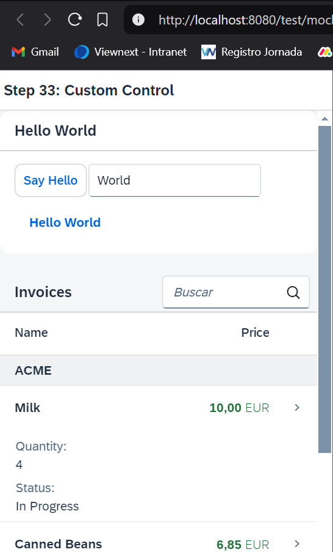

*****************************
# Step 35: Device Adaptation
*****************************

Ahora configuramos la visibilidad y las propiedades de los controles en función del dispositivo en el que ejecutamos la aplicación. Al utilizar la API **sap.ui.Device** y definir un modelo de dispositivo, haremos que la aplicación se vea bien en muchos dispositivos.

*****************************

## Previsualización



#### En los dispositivos telefónicos, el panel está contraído para ahorrar espacio en la pantalla y un botón está oculto

## Código

1. Se modifica [webapp/view/HelloPanel.view.xml](webapp/view/HelloPanel.view.xml)


``` xml
<mvc:View
	controllerName="ui5.walkthrough.controller.HelloPanel"
	xmlns="sap.m"
	xmlns:mvc="sap.ui.core.mvc">
	<Panel
		headerText="{i18n>helloPanelTitle}"
		class="sapUiResponsiveMargin"
		width="auto"
		expandable="{device>/system/phone}"
		expanded="{= !${device>/system/phone} }">
		<content>
			<Button
				id="helloDialogButton"
				icon="sap-icon://world"
				text="{i18n>openDialogButtonText}"
				press=".onOpenDialog"
				class="sapUiSmallMarginEnd sapUiVisibleOnlyOnDesktop"/>
			<Button
				text="{i18n>showHelloButtonText}"
				press=".onShowHello"
				class="myCustomButton"/>
			<Input
				value="{/recipient/name}"
				valueLiveUpdate="true"
				width="60%"/>
			<FormattedText
				htmlText="Hello {/recipient/name}"
				class="sapUiSmallMargin sapThemeHighlight-asColor myCustomText"/>
		</content>
	</Panel>
</mvc:View>
```


Agregamos dos nuevas propiedades expandable y distributed al HelloPanel. El usuario ahora puede cerrar y abrir el panel para tener más espacio para la tabla a continuación en dispositivos con pantallas pequeñas. La propiedad expandable está vinculada a un modelo llamado device y a la ruta /system/phone. Por lo tanto, el panel se puede expandir solo en dispositivos telefónicos. El modelo de dispositivo se completa con la API sap.ui.Device de SAPUI5 como vemos más adelante. La propiedad distributed controla el estado del panel y usamos la sintaxis de vinculación de expresiones para cerrarlo en dispositivos telefónicos y expandir el panel en todos los demás dispositivos. La API device de SAPUI5 ofrece más funciones para detectar varias configuraciones específicas del dispositivo; consulte la documentación para obtener más detalles.


> Nota:			La API sap.ui.Device detecta el tipo de dispositivo (teléfono, tableta, computadora de escritorio) en función del agente de usuario y muchas otras propiedades del dispositivo. Por lo tanto, simplemente reducir el tamaño de la pantalla no cambiará el tipo de dispositivo. Para probar esta función, deberá habilitar la emulación de dispositivo en su navegador o abrirla en un dispositivo real.


También podemos ocultar controles individuales por tipo de dispositivo cuando configuramos una clase CSS como sapUiVisibleOnlyOnDesktop o sapUiHideOnDesktop . Solo mostramos el botón que abre el cuadro de diálogo en los dispositivos de escritorio y lo ocultamos para los demás dispositivos. Para obtener más opciones, consulte la documentación vinculada a continuación.


2. Se modifica [webapp/Component.js](webapp/Component.js)

``` js
sap.ui.define([
	"sap/ui/core/UIComponent",
	"sap/ui/model/json/JSONModel",
	"sap/ui/Device"
], (UIComponent, JSONModel, Device) => {
	"use strict";

	return UIComponent.extend("ui5.walkthrough.Component", {
		metadata: {
			interfaces: ["sap.ui.core.IAsyncContentCreation"],
			manifest: "json"
		},

		init() {
			// call the init function of the parent
			UIComponent.prototype.init.apply(this, arguments);

			// set data model
			const oData = {
				recipient: {
					name: "World"
				}
			};
			const oModel = new JSONModel(oData);
			this.setModel(oModel);

			// set device model
			const oDeviceModel = new JSONModel(Device);
			oDeviceModel.setDefaultBindingMode("OneWay");
			this.setModel(oDeviceModel, "device");

			// create the views based on the url/hash
			this.getRouter().initialize();
		}
	});
});
```


En el componente de la aplicación, agregamos una dependencia a sap.ui.Device e inicializamos el modelo del dispositivo en el método init. Simplemente podemos pasar la dependencia cargada Device a la función constructora de JSONModel. Esto hará que la mayoría de las propiedades de la API del dispositivo SAPUI5 estén disponibles como un modelo JSON. Luego, el modelo se establece en el componente como un modelo con nombre para que podamos hacer referencia a él en el enlace de datos, como hemos visto en la vista anterior.

> Nota:      Tenemos que configurar el modo de enlace en OneWay, ya que el modelo del dispositivo es de solo lectura y queremos evitar cambiar el modelo accidentalmente cuando le enlazamos propiedades de un control. De manera predeterminada, los modelos en SAPUI5 son bidireccionales (TwoWay). Cuando la propiedad cambia, el valor del modelo enlazado también se actualiza.


3. Se modifica [webapp/view/Detail.view.xml](webapp/view/Detail.view.xml)

> TIP:     Puedes probar las funciones específicas del dispositivo de tu aplicación con las herramientas para desarrolladores de tu navegador. Por ejemplo, en Google Chrome, puedes emular una tableta o un teléfono fácilmente y ver los efectos. Algunas opciones de respuesta de SAPUI5 solo se configuran inicialmente al cargar la aplicación, por lo que es posible que tengas que volver a cargar la página para ver los resultados.


``` xml
<mvc:View
    controllerName="ui5.walkthrough.controller.Detail"
    xmlns="sap.m"
    xmlns:mvc="sap.ui.core.mvc"
    xmlns:wt="ui5.walkthrough.control">
    <Page
        title="{i18n>detailPageTitle}"
        showNavButton="true"
        navButtonPress=".onNavBack">
        <ObjectHeader
            responsive="true"
            fullScreenOptimized="true"
            number="{
                parts: [
                    'invoice>ExtendedPrice',
                    'view>/currency'
                ],
                type: 'sap.ui.model.type.Currency',
                formatOptions: {
                    showMeasure: false
                }
            }"
            numberUnit="{view>/currency}"
            intro="{invoice>ShipperName}"
            title="{invoice>ProductName}">
            <attributes>
                <ObjectAttribute
                    title="{i18n>quantityTitle}"
                    text="{invoice>Quantity}"/>
                <ObjectAttribute
                    title="{i18n>dateTitle}"
                    text="{
                        path: 'invoice>ShippedDate',
                        type: 'sap.ui.model.type.Date',
                        formatOptions: {
                            style: 'long',
                            source: {
                            pattern: 'yyyy-MM-ddTHH:mm:ss'
                            }
                        }
                    }"/>
            </attributes>
        </ObjectHeader>
        <wt:ProductRating
            id="rating"
            class="sapUiSmallMarginBeginEnd"
            change=".onRatingChange"/>
    </Page>
</mvc:View>
```

Algunos controles ya tienen funciones de respuesta integradas que se pueden configurar. El control ObjectHeader se puede poner en un modo más flexible configurando el atributo responsive en true y fullScreenOptimized también en true. Esto mostrará los datos que agregamos a la vista ahora en diferentes posiciones en la pantalla según el tamaño del dispositivo.


Agregamos el campo number y numberUnit de la lista de los pasos anteriores también al ObjectHeader y usamos el mismo formateador con el tipo de moneda que en los pasos anteriores. Luego definimos dos atributos: la cantidad de la factura y la fecha de envío que forma parte del modelo de datos. Hasta ahora no hemos usado este campo shippedDate del archivo JSON de facturas, contiene una fecha en formato de cadena típico


Ahora usamos el tipo Fecha y proporcionamos el patrón de nuestro formato de fecha en la sección de origen de las opciones de formato. Se mostrará un texto de fecha con un formato más legible para humanos que también se adapta a dispositivos de pantalla pequeña.


4. Se modifica [webapp/controller/Detail.controller.js](webapp/controller/Detail.controller.js)

``` js
sap.ui.define([
	"sap/ui/core/mvc/Controller",
	"sap/ui/core/routing/History",
	"sap/m/MessageToast",
	"sap/ui/model/json/JSONModel"
], (Controller, History, MessageToast, JSONModel) => {
	"use strict";

	return Controller.extend("ui5.walkthrough.controller.Detail", {
		onInit() {
			const oViewModel = new JSONModel({
				currency: "EUR"
			});
			this.getView().setModel(oViewModel, "view");

			const oRouter = this.getOwnerComponent().getRouter();
			oRouter.getRoute("detail").attachPatternMatched(this.onObjectMatched, this);
		},
		…
	});
});
```

En el controlador de detalles, simplemente agregamos el modelo de vista con nuestra definición de moneda para mostrar el número correctamente. Es el mismo código que en el archivo del controlador de InvoiceList.


5. Se modifica [webapp/i18n/i18n.properties](webapp/i18n/i18n.properties)
``` js
# Detail Page
detailPageTitle=Walkthrough - Details
ratingConfirmation=You have rated this product with {0} stars
dateTitle=Order date
quantityTitle=Quantity
```

Agregamos los nombres de las columnas y los títulos de los atributos a nuestro archivo i18n.

Podemos ver los resultados cuando reducimos el tamaño de la pantalla del navegador o abrimos la aplicación en un dispositivo pequeño.


## Conveciones


+ Optimice su aplicación para los diferentes tamaños de pantalla de teléfonos, tabletas y dispositivos de escritorio.