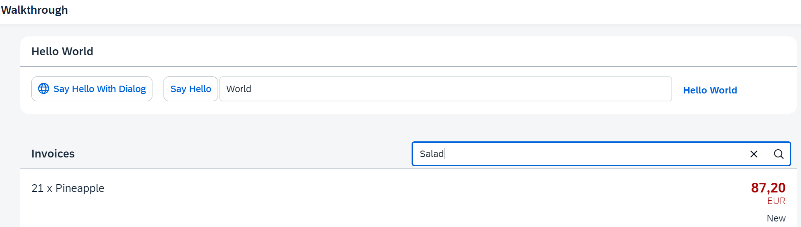

*****************************
# Step 23: Filtering
*****************************

En este paso, agregamos un campo de búsqueda para nuestra lista de productos y definimos un filtro que representa el término de búsqueda. Al realizar una búsqueda, la lista se actualiza automáticamente para mostrar solo los artículos que coinciden con el término de búsqueda.

Se muestra un campo de búsqueda encima de la lista.

1. Se modifica fichero [webapp/view/InvoiceList.view.xml](webapp/view/InvoiceList.view.xml).

La vista se amplía con un control de búsqueda que agregamos a la lista de facturas. También necesitamos especificar un ID invoiceList para que el control de lista pueda identificar la lista a partir de la función del controlador de eventos onFilterInvoices que agregamos al campo de búsqueda. Además, el campo de búsqueda es parte del encabezado de la lista y, por lo tanto, cada cambio en el enlace de la lista activará una nueva representación de toda la lista, incluido el campo de búsqueda.

La agregación headerToolbar reemplaza la propiedad de título simple que usamos antes para nuestro encabezado de lista. Un control de barra de herramientas es mucho más flexible y se puede ajustar como desee. Ahora mostramos el título en el lado izquierdo con un control sap.m.Title, un espaciador y sap.m.SearchField en el lado derecho.

2. Se modifica el fichero [webapp/controller/InvoiceList.controller.js](webapp/controller/InvoiceList.controller.js)

Cargamos dos nuevas dependencias para el filtrado. El objeto de filtro contendrá nuestra configuración para la acción de filtrado y FilterOperator es un tipo auxiliar que necesitamos para especificar el filtro.

En la función onFilterInvoices construimos un objeto de filtro a partir de la cadena de búsqueda que el usuario ha escrito en el campo de búsqueda. Los controladores de eventos siempre reciben un argumento de evento que se puede utilizar para acceder a los parámetros que proporciona el evento. En nuestro caso, el campo de búsqueda define una consulta de parámetros a la que accedemos llamando a getParameter("query") en el parámetro oEvent.

Si la consulta no está vacía, agregamos un nuevo objeto de filtro a la matriz de filtros aún vacía. Sin embargo, si la consulta está vacía, filtramos el enlace con una matriz vacía. Esto garantiza que volvamos a ver todos los elementos de la lista. También podríamos agregar más filtros a la matriz, si quisiéramos buscar más de un campo de datos. En nuestro ejemplo, simplemente buscamos en la ruta ProductName y especificamos un operador de filtro que buscará la cadena de consulta dada.

Se accede a la lista con el ID que hemos especificado en la vista, ya que el control tiene automáticamente como prefijo el ID de la vista, por lo que debemos solicitar a la vista el control con la función auxiliar byId. En el control de lista, accedemos a la vinculación de los elementos de agregación para filtrarlo con nuestro objeto de filtro recién construido. Esto filtrará automáticamente la lista por nuestra cadena de búsqueda de modo que solo se muestren los elementos coincidentes cuando se active la búsqueda. El operador de filtro FilterOperator.Contains no distingue entre mayúsculas y minúsculas.
=======

La vista se amplía con un control de búsqueda que agregamos a la lista de facturas. 

También necesitamos especificar un **ID invoiceList** para que el control de lista pueda identificar la lista a partir de la función del controlador de eventos **onFilterInvoices** que agregamos al campo de búsqueda.

Además, el campo de búsqueda es parte del encabezado de la lista y, por lo tanto, cada cambio en el enlace de la lista activará una nueva representación de toda la lista, incluido el campo de búsqueda.

El control **headerToolbar** reemplaza la propiedad de título simple que usamos antes para nuestro encabezado de lista. 

Un control de barra de herramientas es mucho más flexible y se puede ajustar como desee.

Ahora mostramos el título en el lado izquierdo con un control **sap.m.Title**, un espaciador y sap.m.SearchField en el lado derecho.

2. Se modifica el fichero [webapp/controller/InvoiceList.controller.js](webapp/controller/InvoiceList.controller.js)

Añdimos dos nuevos módulos para el controlador de filtrado. 

El objeto de filtro contendrá nuestra configuración para la acción de filtrado y FilterOperator es un tipo auxiliar que necesitamos para especificar el filtro.

En la función **onFilterInvoices** construimos un objeto de filtro a partir de la cadena de búsqueda que el usuario ha escrito en el campo de búsqueda. 

#### Los controladores de eventos siempre reciben un argumento de evento que se puede utilizar para acceder a los parámetros que proporciona el evento. 

En nuestro caso, el campo de búsqueda define una consulta de parámetros a la que accedemos llamando a **getParameter("query")** en el parámetro **oEvent**.

Si la consulta no está vacía, agregamos un nuevo objeto de filtro a la matriz de filtros aún vacía. Sin embargo, si la consulta está vacía, filtramos el enlace con una matriz vacía. 
Esto garantiza que volvamos a ver todos los elementos de la lista. 

También podríamos agregar más filtros a la matriz, si quisiéramos buscar más de un campo de datos. En nuestro ejemplo, simplemente buscamos en la ruta ProductName y especificamos un operador de filtro que buscará la cadena de consulta dada.

Se accede a la lista con el ID que hemos especificado en la vista, ya que el control tiene automáticamente como prefijo el ID de la vista, por lo que debemos solicitar a la vista el control con la función auxiliar **byId**. 

En el control de lista, accedemos a la vinculación de los elementos de agregación para filtrarlo con nuestro objeto de filtro recién construido. 

Esto filtrará automáticamente la lista por nuestra cadena de búsqueda de modo que solo se muestren los elementos coincidentes cuando se active la búsqueda. 

El operador de filtro **FilterOperator**.Contains no distingue entre mayúsculas y minúsculas.
>>>>>>> 892bfb15d8092f78738ac90b44fa78103cf13c75
