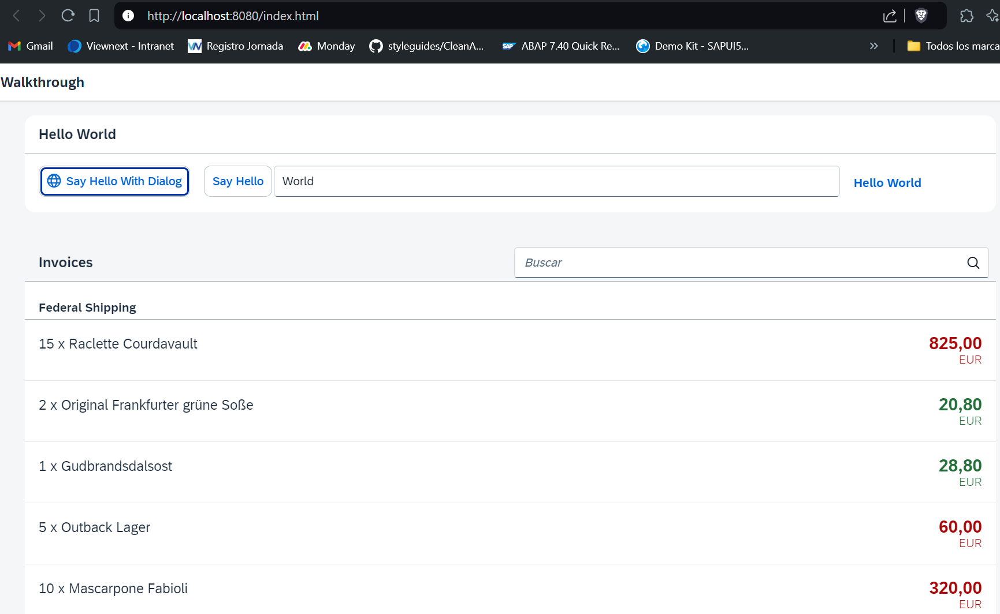

*****************************
# Step 25: Remote OData Service
*****************************

Hasta ahora hemos trabajado con datos JSON locales, pero ahora accederemos a un servicio OData real para visualizar datos remotos.


En el mundo real, los datos suelen residir en servidores remotos y se accede a ellos a través de un servicio OData. 


Agregaremos una configuración de fuente de datos en el fichero manifiesto y reemplazaremos el tipo JSONModel para nuestro modelo de factura con el servicio Northwind OData disponible públicamente para visualizar datos remotos. 


¡Te sorprenderá lo poco que es necesario cambiar para que esto funcione!

> Si no puede ejecutarlo, no se preocupe demasiado, los pasos restantes también funcionarán con los datos JSON locales que ha utilizado hasta ahora. En el Paso 26: Configuración simulada del servidor, aprenderá cómo simular un sistema back-end para lograr un escenario de trabajo similar. Sin embargo, al menos debería leer este capítulo sobre servicios remotos de OData para conocer las fuentes de datos no locales.

## Previsualización


Los productos del servicio de prueba de facturas de OData ahora se muestran dentro de nuestra aplicación

### Instalar servidor proxy
En este paso, queremos utilizar el servicio Northwind OData disponible públicamente ubicado en https://services.odata.org/V2/Northwind/Northwind.svc/. 


Por lo tanto, nuestro URI apuntará al servicio oficial Northwind OData. Para evitar el intercambio de recursos entre orígenes, el procedimiento típico es utilizar un proxy en UI5 Tooling y mantener solo una ruta en la propiedad URI de la fuente de datos de nuestra aplicación.

Hay un montón de soluciones de proxy disponibles en la comunidad UI5 como extensiones de middleware personalizadas de herramientas UI5. 

En este tutorial usaremos ui5-middleware-simpleproxyInformación publicada en un sitio que no es de SAP. 


Abra una nueva ventana de terminal en la carpeta raíz de su aplicación y ejecute **npm i -D ui5-middleware-simpleproxy** para instalar este paquete como una nueva dependencia de desarrollo en su [package.json](package.json).


### UI5.yaml
``` yaml

specversion: '3.0'
metadata:  
  name: ui5.walkthrough
   type: application
framework:  
   name: OpenUI5  
   version: "1.127.0"  
   libraries:    
     - name: sap.m    
     - name: sap.ui.core    
     - name: themelib_sap_horizon
server:  
   customMiddleware:  
     - name: ui5-middleware-simpleproxy    
     afterMiddleware: compression    
     mountPath: /V2    
     configuration:      
         baseUri: "https://services.odata.org"
```

El archivo de configuración ui5.yaml se generó automáticamente en la carpeta raíz de la aplicación durante el Paso 1 de este tutorial cuando ejecutamos el comando init ui5. Ahora configuramos nuestro proxy en el archivo ui5.yaml. La propiedad mountPath configura qué URL serán capturadas por el proxy. La propiedad de configuración/baseUri almacena la dirección real del servidor.


1. Se modifica el ficher [manifiesto](webapp/manifest.json)

``` json
{
	...
	"sap.app": {
		...,
		"dataSources": {
			"invoiceRemote": {
				"uri": "V2/Northwind/Northwind.svc/",
				"type": "OData",
				"settings": {
					"odataVersion": "2.0"
				}
			}
		}
	},
	...
	"sap.ui5": {
		...
		"models": {
			...
			"invoice": {
				"dataSource": "invoiceRemote"
			}
		}
		...
```

En la sección sap.app del archivo descriptor, agregamos una configuración de fuente de datos. Con la clave invoiceRemote, especificamos un objeto de configuración que permite la creación automática de instancias del modelo. Especificamos el tipo de servicio (OData) y la versión del modelo (2.0).

En el apartado de modelos reemplazamos el contenido del modelo de factura. Esta clave todavía se usa como nombre del modelo cuando se crea una instancia automática del modelo durante la inicialización del componente. Sin embargo, el valor de invoiceRemote de la clave dataSource es una referencia a la sección de fuente de datos que especificamos anteriormente. Esta configuración permite que el componente recupere la información técnica de este modelo durante el inicio de la aplicación.

Nuestro componente ahora crea automáticamente una instancia de sap.ui.model.odata.v2.ODataModel de acuerdo con la configuración que especificamos anteriormente y la asigna a disposición como un modelo denominado factura. Cuando utiliza la fuente de datos de BillRemote, ODataModel obtiene los datos del servicio OData real de Northwind. Las facturas que recibimos del servicio Northwind OData tienen propiedades idénticas a los datos JSON que utilizamos anteriormente (excepto la propiedad de estado, que no está disponible en el servicio Northwind OData).

> Si desea tener un modelo predeterminado en el componente, puede cambiar el nombre del modelo a una cadena vacía en el archivo descriptor. Los modelos creados automáticamente se pueden recuperar llamando a this.getModel en el componente. En los controladores de aplicaciones basadas en componentes, puede llamar a this.getView().getModel() para obtener el modelo instanciado automáticamente. Para recuperar un modelo con nombre, debe pasar el nombre del modelo definido en el archivo descriptor a getModel, es decir, en el componente que llamaría this.getModel("invoice") para obtener nuestro modelo de factura generado automáticamente que definimos en el descriptor