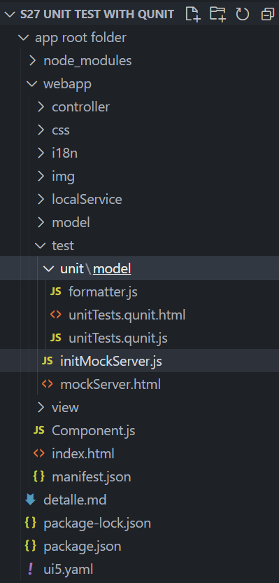

*****************************
# Step 27: Unit Test with QUnit
*****************************

Ahora que tenemos una carpeta de prueba en la aplicación, podemos comenzar a aumentar nuestra cobertura de pruebas.
**********

En realidad, cada característica que agregamos a la aplicación hasta ahora requeriría un caso de prueba separado. Hemos descuidado esto por completo hasta ahora, así que agreguemos una prueba unitaria simple para nuestra función de formateador personalizada del Paso 23. Probaremos si el texto largo de nuestro estado es correcto comparándolo con los textos de nuestro paquete de recursos.

> En este tutorial, nos centramos en un caso de uso simple para la implementación de prueba. Si desea obtener más información sobre las pruebas QUnit, consulte nuestro tutorial Tutorial de pruebas, especialmente el Paso 2: una primera prueba unitaria.

### Previsualización



Ya está disponible una prueba unitaria para nuestros formateadores.

Estructura de carpetas para este paso.


Agregamos una nueva carpeta debajo de la carpeta de prueba y una subcarpeta de modelo donde colocaremos nuestra prueba unitaria del formateador. La estructura de carpetas coincide con la estructura de la aplicación para encontrar fácilmente las pruebas unitarias correspondientes.

1. Se crea nueva carpeta y fichero [webapp/test/unit/model/formatter.js](webapp/test/unit/model/formatter.jss)

``` js
sap.ui.define([
	"ui5/walkthrough/model/formatter",
	"sap/ui/model/resource/ResourceModel",
], (formatter, ResourceModel) => {
	"use strict";

	QUnit.module("Formatting functions", {});

	QUnit.test("Should return the translated texts", (assert) => {
        
		const oResourceModel = new ResourceModel({
            bundleUrl: sap.ui.require.toUrl("ui5/walkthrough/i18n/i18n.properties"),
            supportedLocales: [""],
            fallbackLocale: "" });

        const oControllerMock = {
            getOwnerComponent() {
                return {
                    getModel() {
                        return oResourceModel;
                    }
                };
            }
        };

        const fnIsolatedFormatter = formatter.statusText.bind(oControllerMock);

        // Assert
        assert.strictEqual(fnIsolatedFormatter("A"), "New", "The long text for Status A is correct");
        assert.strictEqual(fnIsolatedFormatter("B"), "In Progress", "The long text for Status B is correct");
        assert.strictEqual(fnIsolatedFormatter("C"), "Done", "The long text for Status C is correct");
        assert.strictEqual(fnIsolatedFormatter("Foo"), "Foo", "The long text for Status Foo is correct");
	});
});
```

Creamos un nuevo archivo formatter.js en webapp/test/unit/model donde se implementa la prueba unitaria para el formateador personalizado. El archivo formateador que queremos probar se carga como una dependencia.

El archivo del formateador solo contiene un módulo QUnit para nuestra función del formateador y una prueba unitaria para la función del formateador. En la implementación de la función statusText que creamos en el Paso 23, usamos los textos traducidos al llamar al formateador. Como no queremos probar la funcionalidad de enlace de UI5, simplemente usamos texto en la prueba en lugar de un ResourceBundle.

Finalmente, realizamos nuestras afirmaciones. Verificamos cada rama de la lógica del formateador invocando la función de formateador aislada con los valores que esperamos en el modelo de datos (A, B, C y todo lo demás). Comparamos estrictamente el resultado de la función de formateo con las cadenas codificadas que esperamos del paquete de recursos y damos un mensaje de error significativo si la prueba falla.

2. Se crea nuevo fichero [webapp/test/unit/unitTests.qunit.html](webapp/test/unit/unitTests.qunit.html)

``` xml
<!DOCTYPE html>
<html>
<head>
	<title>Unit tests for UI5 Walkthrough</title>
	<meta charset="utf-8">

	<script
		id="sap-ui-bootstrap"
		src="../../resources/sap-ui-core.js"
		data-sap-ui-resource-roots='{"ui5.walkthrough": "../../"}'
		data-sap-ui-async="true">
	</script>

	<link rel="stylesheet" type="text/css" href="../../resources/sap/ui/thirdparty/qunit-2.css">

	<script src="../../resources/sap/ui/thirdparty/qunit-2.js"></script>
	<script src="../../resources/sap/ui/qunit/qunit-junit.js"></script>

	<script src="unitTests.qunit.js"></script>
</head>
<body>
	<div id="qunit"/>
	<div id="qunit-fixture"/>
</body>
</html>
```

El llamado conjunto de pruebas QUnit es una página HTML que activa todas las pruebas QUnit para la aplicación. La mayor parte genera el diseño de la página de resultados que puede ver en la vista previa y no explicaremos más estas partes, sino que nos centraremos en las partes de la aplicación.

Comencemos con los espacios de nombres. Como ahora estamos en la carpeta webapp/test/unit, en realidad necesitamos subir dos niveles para obtener la carpeta webapp nuevamente. Este espacio de nombres se puede utilizar dentro de las pruebas para cargar y activar la funcionalidad de la aplicación.

Primero, cargamos algunas funciones básicas de QUnit mediante etiquetas de script. Aquí también se pueden agregar otras pruebas QUnit. Luego, la página HTML carga otro script llamado unitTests.qunit.js, que crearemos a continuación. Este script ejecutará nuestro formateador.


3. Se crea el fichero [webapp/test/unit/unitTests.qunit.js](webapp/test/unit/unitTests.qunit.js)

``` js
QUnit.config.autostart = false;

sap.ui.require(["sap/ui/core/Core"], async(Core) => {
	"use strict";

	await Core.ready();

	sap.ui.require([
		"ui5/walkthrough/test/unit/model/formatter"
	], () => {
		QUnit.start();
	});
});
```

Este script carga y ejecuta nuestro formateador. Si ahora abrimos el archivo webapp/test/unit/unitTests.qunit.html en el navegador, deberíamos ver nuestra prueba ejecutándose y verificando la lógica del formateador.

## Convenciones
+ Todas las pruebas unitarias se colocan en la carpeta webapp/test/unit de la aplicación.

+ Los archivos del conjunto de pruebas terminan en *.qunit.html.

+ El archivo unitTests.qunit.html activa todas las pruebas unitarias de la aplicación.

+ Se debe escribir una prueba unitaria para formateadores, lógica de controlador y otras funciones individuales.

+ Todas las dependencias se reemplazan por apéndices para probar solo la funcionalidad dentro del alcance.