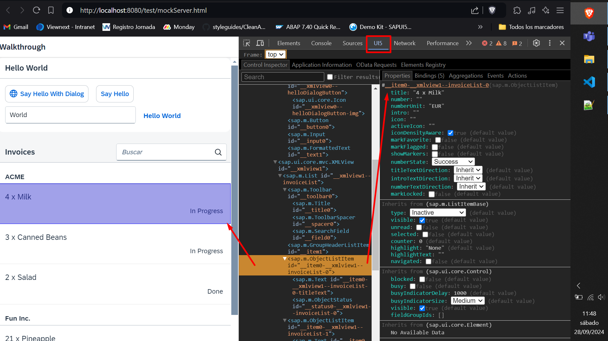

*****************************
# Step 29: Debugging Tools
*****************************

Aunque agregamos una cobertura de prueba básica en los pasos anteriores, parece que accidentalmente rompimos nuestra aplicación porque ya no muestra los precios en nuestras facturas. Necesitamos depurar el problema y solucionarlo antes de que alguien se entere.
**********

Afortunadamente, SAPUI5 proporciona un par de herramientas de depuración que podemos usar dentro de la aplicación para verificar la lógica de la aplicación y las herramientas de desarrollo de los navegadores modernos también son bastante buenas. Ahora buscaremos la causa raíz.


## Previsualización


La lista de facturas ahora la proporciona el servidor simulado.

1. Se modifica fichero [webapp/view/InvoiceList.view.xml](webapp/view/InvoiceList.view.xml)

``` xml
<mvc:View
    controllerName="ui5.walkthrough.controller.InvoiceList"
    xmlns="sap.m"
    xmlns:core="sap.ui.core"
    xmlns:mvc="sap.ui.core.mvc">

    <List
        id="invoiceList"
        headerText="{i18n>invoiceListTitle}"
        class="sapUiResponsiveMargin"
        width="auto"
        items="{
            path : 'invoice>/Invoices',
            sorter : {
                path : 'ShipperName',
                group : true
            }
        }">

        <headerToolbar>
            <Toolbar>
                <Title text="{i18n>invoiceListTitle}" />
                <ToolbarSpacer />
                <SearchField
                    width="50%"
                    search=".onFilterInvoices"/>
            </Toolbar>
        </headerToolbar>
        <items>
            <ObjectListItem
                title="{invoice>Quantity} x {invoice>ProductName}"
                number="{
                    parts: [
                        'invoice>ExTendedPrice',
                        'view>/currency'
                    ],
                    type: 'sap.ui.model.type.Currency',
                    formatOptions: {
                        showMeasure: false
                    }
                }"
                numberUnit="{view>/currency}"
                numberState="{= ${invoice>ExtendedPrice} > 50 ? 'Error' : 'Success' }">
                <firstStatus>
                    <ObjectStatus
                        core:require="{
                            Formatter: 'ui5/walkthrough/model/formatter'
                        }"
                        text="{
                            path: 'invoice>Status',
                            formatter: 'Formatter.statusText.bind($controller)'
                        }"/>
                </firstStatus>
            </ObjectListItem>
        </items>
    </List>
</mvc:View>
```

Introdujimos un error tipográfico en la vinculación del atributo numérico para simular un error frecuente; en lugar de usar 'invoice>ExtendedPrice' usamos 'invoice>ExTendedPrice'. 


Ahora llamamos a la aplicación y notamos que en realidad falta el precio. Al ingresar el acceso directo Ctrl Shift Alt / Opción S abrimos la herramienta de diagnóstico de soporte SAPUI5 y verificamos la aplicación.


> Si utiliza el navegador Google Chrome, puede instalar el complemento UI5 Inspector. Con este complemento, puede depurar fácilmente sus aplicaciones basadas en SAPUI5 u OpenUI5. Para obtener más información, consulte Inspector UI5.

Además de la información técnica sobre la aplicación y un seguimiento similar a la consola de herramientas de desarrollador del navegador, hay una herramienta realmente útil para comprobar dichos errores en este cuadro de diálogo. Abra la pestaña Árbol de control haciendo clic en el símbolo de expansión a la derecha.

Se muestra un árbol jerárquico de controles SAPUI5 a la izquierda y las propiedades del control seleccionado se muestran a la derecha. Si ahora seleccionamos el primer control ObjectListItem del árbol y vamos a la pestaña Información de enlace a la derecha, podemos ver que la ruta de enlace del atributo numérico está marcada como no válida. Ya podemos corregir el error en la vista y el precio debería volver a aparecer en el listado de facturas.

A veces los errores no son tan fáciles de detectar y en realidad es necesario depurar el código JavaScript con las herramientas del navegador.


## Convenciones


- Según la convención SAPUI5, los archivos fuente sin comprimir terminan con *-dbg.js.
